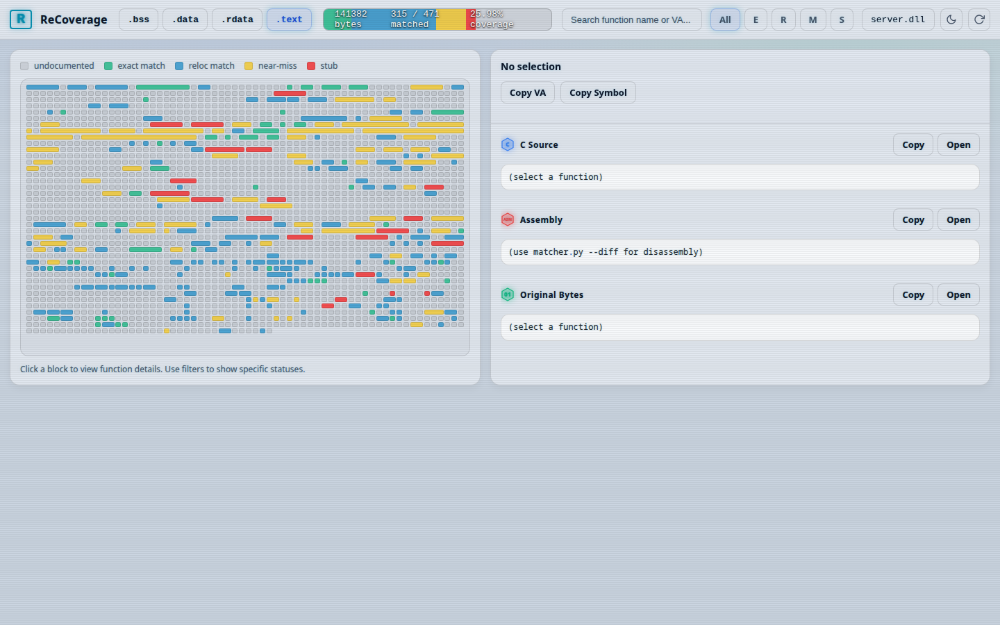
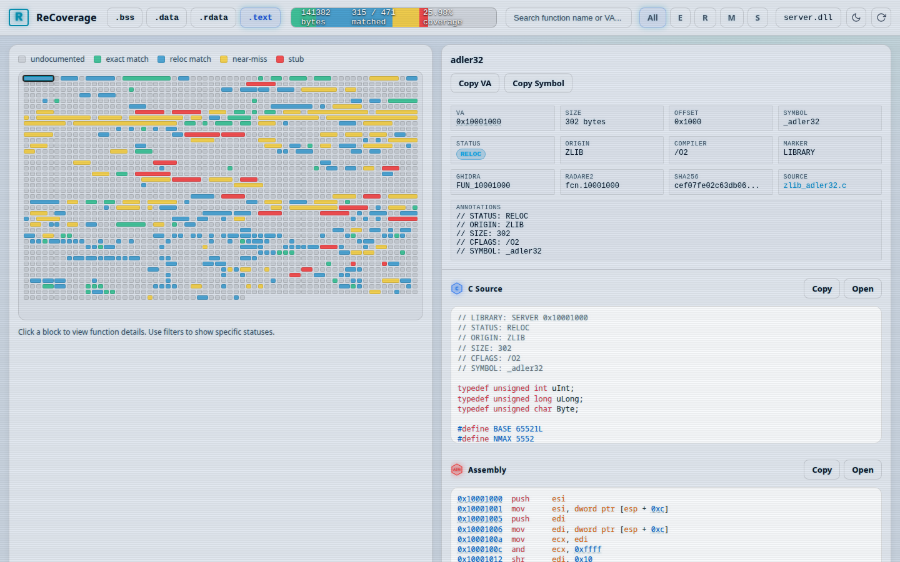
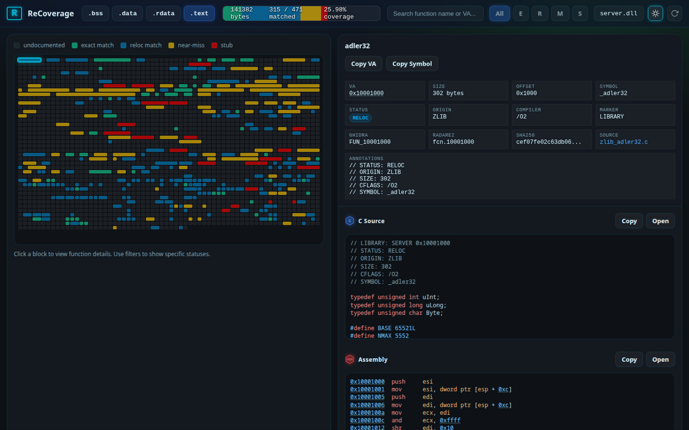
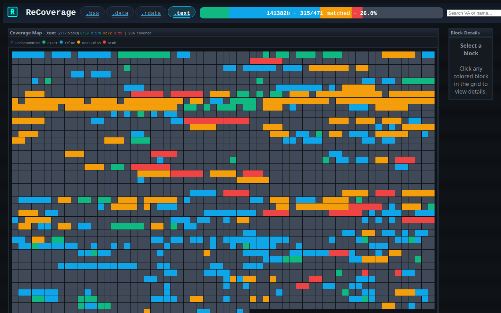

# 🔍 recoverage

<p align="center">
  
  <br>
  <strong>Coverage dashboard for binary-matching decompilation projects.</strong>
  <br>
  <em>See every byte. Track every match. Ship the decomp.</em>
</p>

<p align="center">
  <a href="#installation">Install</a> ·
  <a href="#quick-start">Quick Start</a> ·
  <a href="#screenshots">Screenshots</a> ·
  <a href="#potato-mode">Potato Mode</a>
</p>

---

## What is recoverage?

**recoverage** serves a local web dashboard that visualises per-byte match
status across `.text`, `.data`, `.bss`, and other PE sections of a
decompilation project. Think of it as a **defrag map for your decomp** —
every byte of the original binary is a cell in a grid, colored by how
closely your C code matches the original compiled output.

### 🚀 Features

- **Byte-Perfect Confidence**: Stop guessing if your C code produced the correct assembly. See exact byte comparisons visually.
- **Fast Iteration**: Quickly identify which parts of a function are matching and which parts have diverged (e.g. register allocation differences, instruction reordering).
- **Interactive Triage**: Click any block in the grid to immediately view the corresponding C source, disassembled binary, and hex diff.

### ✨ Highlights

| | |
|---|---|
| 🧱 **Defrag-style grid** | One cell per chunk — Exact (green), Reloc (cyan), Matching (yellow), Stub (red), None (gray) |
| 🔎 **Function detail panel** | Click any cell to see metadata, C source, disassembly, and hex dump side-by-side |
| 🌗 **Light & dark themes** | Retro CRT dark mode by default, clean light mode one click away |
| 🔗 **Clickable cross-references** | Hex addresses in disassembly are live links — click to jump to that chunk |
| 📊 **Interactive progress bar** | Segmented by status; click a segment to filter the grid |
| 🗜️ **First draw in first TCP packet** | HTML + CSS + JS inlined & compressed (Brotli/Zstd) to ~14.5 KB |
| 🥔 **Potato Mode** | Zero-JS server-rendered fallback for constrained environments |
| 🔄 **Live regen** | One-click re-catalog + rebuild without restarting the server |

## Screenshots

### Main Dashboard



### Function Detail



### Dark Mode



### 🥔 Potato Mode



Potato Mode is a **zero-JavaScript**, server-side rendered HTML fallback.
Every view is a plain HTML table — no CSS, no JS — so it works on
low-spec machines, restricted browsers, or anywhere you just want a quick
glance without loading the full SPA.

---

## Installation

```bash
pip install recoverage
```

For development:

```bash
uv pip install -e ../recoverage
```

### Optional runtime extras

| Package | What it does |
|---------|--------------|
| capstone | Enables on-demand disassembly in the detail panel |
| pygments | Syntax highlighting in Potato Mode |

---

## Quick Start

```bash
# 1. Generate the coverage database (from your project directory)
uv run rebrew catalog --json
# Analyzes the target binary, parses your annotations, and dumps raw match data to db/data_*.json

uv run rebrew build-db
# Consumes the JSON files and builds a fast SQLite database (db/coverage.db) for the dashboard

# 2. Start the dashboard
uv run recoverage serve
# Starts a lightweight Bottle web server serving the frontend SPA and providing the API backend
```

> [!NOTE]
> The server reads `db/coverage.db` relative to the **current working
> directory**, so run it from your project root — the directory that
> contains `rebrew.toml`.

---

## CLI Commands

### `recoverage serve`

Start the dashboard web server.

| Flag | Default | Description |
|------|---------|-------------|
| `--port` | `8001` | HTTP port to serve on |
| `--no-open` | off | Don't auto-open the browser |
| `--regen` | off | Run `rebrew catalog` + `rebrew build-db` before starting |
| `--cors` | off | Enable CORS headers for cross-origin API access |

### `recoverage stats`

Print per-section coverage stats as a Rich table.

```bash
recoverage stats                    # all targets
recoverage stats --target SERVER    # single target
```

### `recoverage export`

Export coverage data to stdout.

```bash
recoverage export --format json     # JSON (default)
recoverage export --format csv      # CSV
recoverage export --format md       # Markdown table
```

### `recoverage check`

CI gate — exits non-zero if coverage is below a threshold.

```bash
recoverage check --min-coverage 60                              # all targets, all sections
recoverage check --min-coverage 60 --target SERVER --section .text   # specific
```

### `recoverage open`

Open the dashboard in a browser (useful when `--no-open` was used).

```bash
recoverage open --port 8001
```

---

## API Endpoints

| Path | Method | Description |
|------|--------|-------------|
| `/` | GET | Main SPA dashboard |
| `/potato` | GET | Potato Mode (pure-HTML fallback) |
| `/api/health` | GET | Server version, DB info, installed extras |
| `/api/targets` | GET | List available targets |
| `/api/targets/<target>/stats` | GET | Per-section coverage stats with percentages |
| `/api/targets/<target>/data` | GET | Section + cell data (`?section=.text` for partial) |
| `/api/targets/<target>/functions` | GET | Paginated list (`?status=&search=&sort=&limit=&offset=`) |
| `/api/targets/<target>/functions/<va>` | GET | Single function/global detail |
| `/api/targets/<target>/asm` | GET | Disassembly (`?format=json` for structured output) |
| `/api/targets/<target>/sections/<section>/bytes` | GET | Raw byte slice (`?offset=&size=`) |
| `/regen` | POST | Re-run catalog + build-db (localhost only) |

---

## Architecture & How it works

**recoverage** is designed as a standalone **consumer** of the data that [rebrew](../rebrew) produces — the two packages are intentionally decoupled.

```text
rebrew catalog --json          rebrew build-db           recoverage (Bottle + SQLite)
       │                             │                       │
  db/data_*.json  ──────────▶  db/coverage.db  ──────────▶  VanJS Dashboard
```

1. **`rebrew catalog --json`**: Scans your project's source annotations and writes intermediate `db/data_*.json` files containing coverage metrics. Jump table / switch data bytes are absorbed into their parent function's size. Use `--export-ghidra-labels` to generate `ghidra_data_labels.json` for round-trip Ghidra sync.
2. **`rebrew build-db`**: Consumes those JSON files and builds a structured `db/coverage.db` (SQLite v2 schema) database, storing per-function metadata (`detected_by`, `size_by_tool`, `textOffset`), per-global metadata (`origin`, `size`), per-cell metadata (`label`, `parent_function`), and stamping `db_version` for schema detection. See [DB_FORMAT.md](../rebrew/docs/DB_FORMAT.md) for the full schema.
3. **`recoverage`**: Starts a **Bottle** web server. The backend serves API endpoints querying the SQLite database, while the frontend is a zero-build Single Page Application (SPA) powered by **VanJS**, rendering the interactive defrag grid.

You can run `recoverage` independently on any machine (or even host it remotely) as long as it has access to a compiled `coverage.db` — no `rebrew` dependency or compiler toolchain is required.

---

## Project layout

```
recoverage/
├── pyproject.toml
├── README.md
├── docs/                  # Screenshots, mascot & design doc
│   └── DESIGN.md          # Detailed architecture & design doc
└── src/recoverage/
    ├── __init__.py
    ├── __main__.py        # python -m recoverage
    ├── cli.py             # Typer CLI entry point
    ├── server.py          # Bottle app, shared helpers & compression
    ├── api.py             # REST API routes (/api/*)
    ├── ui.py              # UI routes (/, /potato, static files)
    ├── potato.py          # Potato Mode renderer
    └── assets/
        ├── index.html     # SPA shell
        ├── style.css
        ├── app.js         # VanJS frontend
        └── van.min.js     # VanJS library (1.0 KB)
```

---

## License

MIT
