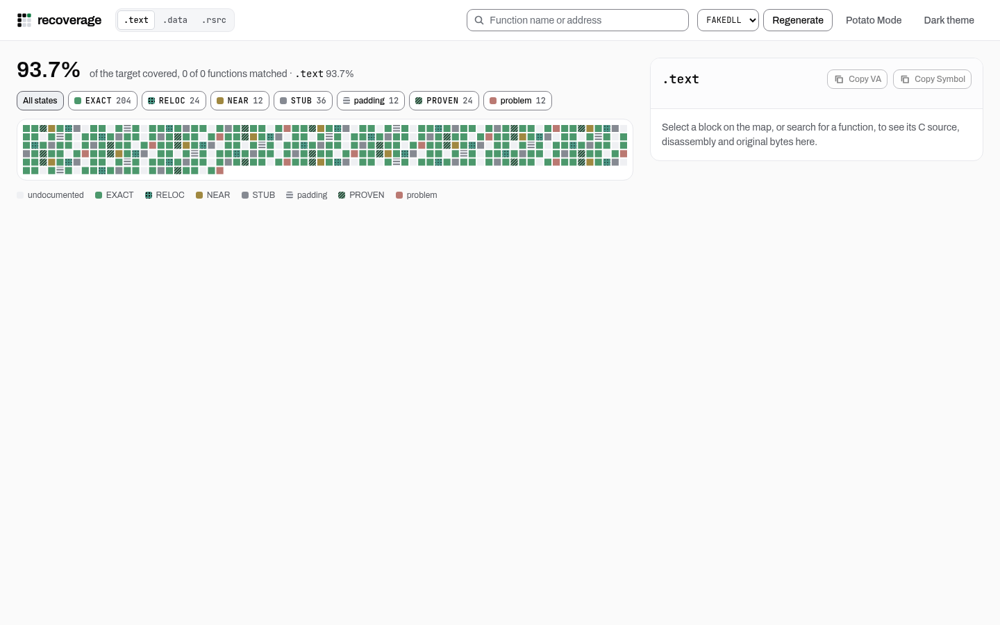
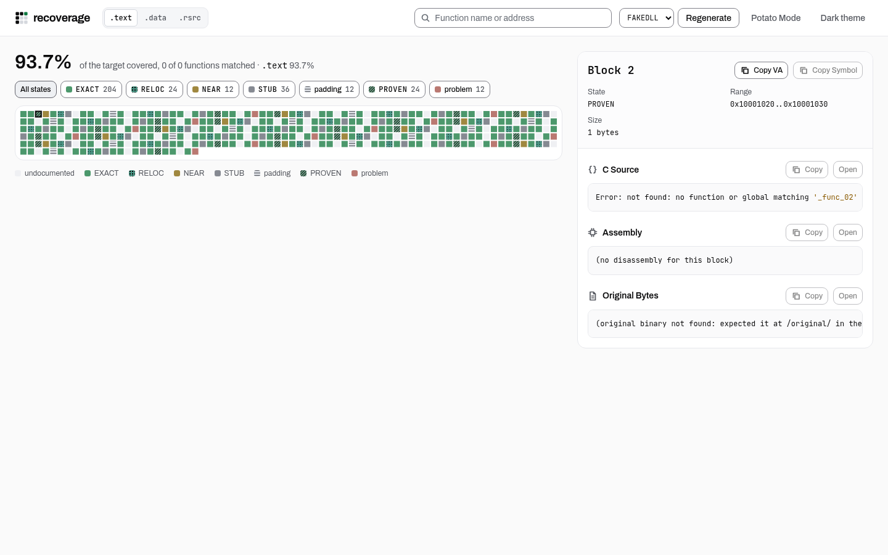
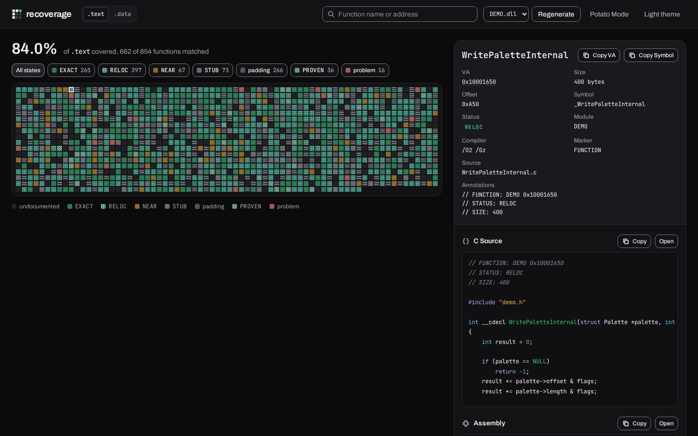
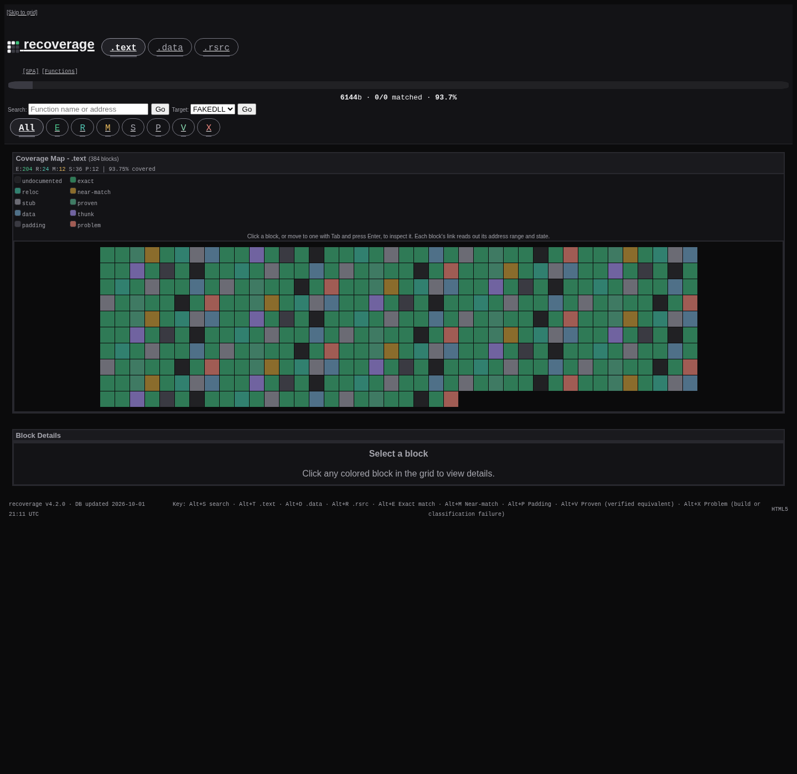

# recoverage

<p align="center">
  
  <br>
  <strong>Coverage dashboard for binary-matching decompilation projects.</strong>
  <br>
  <em>See every byte. Track every match. Ship the decomp.</em>
</p>

<p align="center">
  <a href="#installation">Install</a> ·
  <a href="#quick-start">Quick Start</a> ·
  <a href="#screenshots">Screenshots</a> ·
  <a href="#potato-mode">Potato Mode</a> ·
  <a href="#continuous-integration">CI</a>
</p>

---

## What is recoverage?

**recoverage** serves a local web dashboard that visualises per-byte match
status across `.text`, `.data`, `.bss`, and other PE sections of a
decompilation project. Think of it as a **defrag map for your decomp** —
every byte of the original binary is a cell in a grid, colored by how
closely your C code matches the original compiled output.

### Features

- **Byte-Perfect Confidence**: Stop guessing if your C code produced the correct assembly. See exact byte comparisons visually.
- **Fast Iteration**: Quickly identify which parts of a function are matching and which parts have diverged (e.g. register allocation differences, instruction reordering).
- **Interactive Triage**: Click any block in the grid to immediately view the corresponding C source, disassembled binary, and hex diff.

### Details

| What | How |
|---|---|
| Defrag-style grid | One cell per chunk, colored by state: Exact (green), Reloc (cyan), Near-match (yellow), Stub (red), None (gray) |
| Function detail panel | Click any cell for metadata, C source, disassembly, and hex dump side by side |
| Light and dark themes | Retro CRT dark mode by default, clean light mode one click away |
| Clickable cross-references | Hex addresses in the disassembly are live links that jump to that chunk |
| Interactive progress bar | Segmented by state; click a segment to filter the grid |
| First draw in first TCP packet | HTML, CSS, and JS inlined and compressed (Brotli/Zstd) to ~14.5 KB |
| Potato Mode | Zero-JS server-rendered fallback for constrained environments |
| Live regen | Re-catalog and rebuild from the browser without restarting the server |

## Screenshots

### Main Dashboard



### Function Detail



### Dark Mode



### Potato Mode



Potato Mode is a **zero-JavaScript**, server-side rendered HTML fallback.
Every view is a plain HTML table — no CSS, no JS — so it works on
low-spec machines, restricted browsers, or anywhere you just want a quick
glance without loading the full SPA.

---

## Installation

```bash
pip install recoverage
```

For development, see [CONTRIBUTING.md](CONTRIBUTING.md) — recoverage depends on
a sibling rebrew checkout, so the bootstrap is two commands:

```bash
make clone-rebrew   # rebrew v2.13.1 into ../rebrew
make setup          # uv sync --frozen --extra dev
make test           # or: make test-one T=tests/test_api.py
uv run recoverage serve
```

> [!IMPORTANT]
> `rebrew` is a path dependency resolved to `../rebrew`
> (`[tool.uv.sources]` in `pyproject.toml`), so recoverage must sit beside a
> rebrew checkout. `git clone` recoverage on its own, or any git worktree of
> it, leaves `uv sync` failing with
> `Distribution not found at file:///.../rebrew`. Put the two side by side
> (or point that source at a rebrew you already have) before running
> anything.

### Optional runtime extras

Install an extra to enable its feature: `pip install 'recoverage[<extra>]'`
(or `uv sync --extra <extra>` in a workspace).

| Extra | Package | What it does |
|-------|---------|--------------|
| `capstone` | capstone | Enables on-demand disassembly in the detail panel |
| `pygments` | pygments | Syntax highlighting in Potato Mode |
| `playwright` | playwright, pytest-playwright | Browser integration tests (`tests/test_playwright.py`) |

---

## Quick Start

```bash
# 1. Generate the coverage database (from your project directory)
uv run rebrew catalog
# Analyzes the target binary, parses your annotations, and dumps raw match data to db/data_*.json

uv run rebrew build-db
# Consumes the JSON files and builds a fast SQLite database (db/coverage.db) for the dashboard

# 2. Start the dashboard
uv run recoverage serve
# Starts a lightweight Bottle web server serving the frontend SPA and providing the API backend
```

> [!NOTE]
> The server resolves `coverage.db` from the **current working directory**:
> `[project] db_dir` in `rebrew-project.toml` when set, falling back to
> `db/coverage.db` — so run it from your project root.

---

## CLI Commands

### `recoverage serve`

Start the dashboard web server.

| Flag | Default | Description |
|------|---------|-------------|
| `--port` | `8001` | HTTP port to serve on |
| `--bind` | `127.0.0.1` | Interface to bind to (use `0.0.0.0` for LAN access) |
| `--allow-remote` | off | Required with a non-loopback `--bind`: acknowledge the API is reachable on the network |
| `--token` | off | Require this token for every request (`Authorization: Bearer`, `?token=`, or open `/?token=<token>` to set the SPA cookie) |
| `--no-open` | off | Don't auto-open the browser |
| `--regen` | off | Run `rebrew catalog` + `rebrew build-db` before starting |
| `--cors` | off | Enable CORS processing (allowlisted origins only; the wildcard is never emitted) |
| `--cors-origin` | none | Origin URL allowed to read the API cross-origin (repeatable; without it `--cors` allows no cross-origin reads) |

### `recoverage stats`

Print per-section coverage stats as a Rich table, or as JSON with `--json`.

```bash
recoverage stats                    # all targets
recoverage stats --target SERVER    # single target
recoverage stats --json             # machine-readable
```

### `recoverage export`

Export coverage data to stdout.

```bash
recoverage export --format json     # JSON (default)
recoverage export --format csv      # CSV
recoverage export --format md       # Markdown table
```

### `recoverage check`

CI gate — exits non-zero if coverage is below a threshold.  Sections the
grid never records matches for (e.g. `.bss`/`.data` when only `.text`
matches are tracked) are skipped, not failed.

```bash
recoverage check --min-coverage 60                              # all targets, all sections
recoverage check --min-coverage 60 --target SERVER --section .text   # specific
recoverage check --min-coverage 60 --json                       # machine-readable verdict
```

Exit codes: 0 = gate passed, 1 = coverage below threshold (or bad input),
2 = infrastructure error (database missing/unreadable).

### `recoverage regen`

Re-run `rebrew catalog` + `rebrew build-db` to regenerate `coverage.db`.

```bash
recoverage regen
```

recoverage calls rebrew's catalog and build-db functions as a library, in its
own process, not by spawning the `rebrew` console script.  The run has no
timeout, so it always runs to completion; the dashboard's threaded server keeps
serving while it is busy.  A failure exits 1.

### `recoverage open`

Open the dashboard in a browser (useful when `--no-open` was used).

```bash
recoverage open --port 8001
```

---

## API Endpoints

| Path | Method | Description |
|------|--------|-------------|
| `/` | GET | Main SPA dashboard |
| `/potato` | GET | Potato Mode (pure-HTML fallback) |
| `/api/health` | GET | Server version, DB info, installed extras |
| `/api/targets` | GET | List available targets |
| `/api/targets/<target>/stats` | GET | Per-section coverage stats with percentages |
| `/api/targets/<target>/data` | GET | Section + cell data (`?section=.text` for partial) |
| `/api/targets/<target>/functions` | GET | Paginated list (`?status=&search=&sort=&limit=&offset=`) |
| `/api/targets/<target>/functions` | POST | Batch lookup: `{"vas": [...]}` → function/global details in input order |
| `/api/targets/<target>/functions/<va>` | GET | Single function/global detail |
| `/api/targets/<target>/asm` | GET | Disassembly (`?format=json` for structured output) |
| `/api/targets/<target>/sections/<section>/bytes` | GET | Raw byte slice (`?offset=&size=`) |
| `/api/events` | GET | Server-Sent Events: `db-updated` when coverage.db changes (SPA auto-refresh) |
| `/api/regen` | POST | Re-run catalog + build-db (localhost only, rate-limited) |

---

## Architecture & How it works

**recoverage** is designed as a standalone **consumer** of the data that [rebrew](../rebrew) produces — the two packages are intentionally decoupled.

```text
rebrew catalog                 rebrew build-db           recoverage (Bottle + SQLite)
       │                             │                       │
  db/data_*.json  ──────────▶  db/coverage.db  ──────────▶  VanJS Dashboard
```

1. **`rebrew catalog`**: Scans your project's source annotations and writes intermediate `db/data_*.json` files containing coverage metrics. Jump table / switch data bytes are absorbed into their parent function's size. Use `--export-ghidra-labels` to generate `ghidra_data_labels.json` for round-trip Ghidra sync.
2. **`rebrew build-db`**: Consumes those JSON files and builds a structured `db/coverage.db` (SQLite, `db_version` `"10"`) database, storing per-function metadata (`detected_by`, `size_by_tool`, `textOffset`), per-global metadata (`module`, `size`), per-cell metadata (`label`, `parent_function`), and stamping `db_version` for schema detection.  It also materializes the two objects the dashboard reads instead of re-deriving them on every request: the per-section coverage buckets (`section_cell_stats`) and the per-section cell JSON (`section_cells_json`, zstd, cells ordered by `start`).  Both are derived from `cells` and rebuilt on every build, so a database produced by an older rebrew is still *served*. The server falls back to the equivalent live queries. `rebrew build-db` requires `--force` to migrate a database whose stamp is not `"10"`. See [DB_FORMAT.md](../rebrew/docs/DB_FORMAT.md) for the full schema.
3. **`recoverage`**: Starts a **Bottle** web server. The backend serves API endpoints querying the SQLite database, while the frontend is a zero-build Single Page Application (SPA) powered by **VanJS**, rendering the interactive defrag grid.

You can run `recoverage` independently on any machine (or even host it remotely) as long as it has access to a compiled `coverage.db`.  rebrew is a required dependency (it provides the shared workspace/config resolution and the in-process regen), but no project workspace or compiler toolchain is required to serve the dashboard.

---

## Project layout

```
recoverage/
├── pyproject.toml
├── README.md
├── docs/                     # Screenshots, mascot & design doc
│   ├── DESIGN.md             # Detailed architecture & design doc
│   ├── DESIGN_PRINCIPLES.md  # Core operational philosophies
│   ├── USER_STORIES.md       # User stories with acceptance criteria
│   └── ideas.md              # Future improvement ideas
├── tests/
│   ├── conftest.py           # Shared fixtures (synthetic coverage.db)
│   ├── test_api.py           # API validation & security tests
│   ├── test_cli.py           # CSV export, formatting tests
│   ├── test_lifecycle.py     # Lifecycle (regen ordering, opener reaping, deadlines)
│   ├── test_paths.py         # DB path resolution tests
│   ├── test_server.py        # Compression, encoding tests
│   ├── test_potato.py        # Potato Mode rendering tests
│   ├── test_perf.py         # Deterministic perf regression gates (work counters, not wall clock)
│   └── test_playwright.py    # Browser integration tests
└── src/recoverage/
    ├── __init__.py
    ├── __main__.py           # python -m recoverage
    ├── _paths.py             # DB path resolution (rebrew-project.toml db_dir)
    ├── cli.py                # Typer CLI entry point
    ├── server.py             # Bottle app, shared helpers & compression
    ├── regen.py              # In-process rebrew regen (catalog + build-db)
    ├── api.py                # REST API routes (/api/*)
    ├── ui.py                 # UI routes (/, /potato, static files)
    ├── potato.py             # Potato Mode renderer
    ├── webapp.py             # Composition root: imports api+ui so app has every route
    └── assets/
        ├── index.html        # SPA shell
        ├── style.css         # All styles
        ├── print.css         # Print stylesheet
        ├── app.js            # VanJS frontend
        ├── detail.js         # Deferred panel logic (hex dump, modal, live reload)
        ├── van.min.js        # VanJS library (~2 KB)
        ├── favicon.svg       # Retro "R" logo favicon
        ├── hljs.min.js       # Highlight.js core
        ├── hljs-c.min.js     # Highlight.js C grammar
        ├── hljs-x86asm.min.js # Highlight.js x86 asm grammar (hex lang is in detail.js)
        └── hljs.css          # Highlight.js theme
```

---

## Continuous integration

`.github/workflows/ci.yml` runs on every push to `main` and every pull
request against `main`. A new push to a PR branch cancels the run in flight
on that branch; runs on `main` are never cancelled, so no commit loses a
check.

| Job | Runner | What it enforces |
|-----|--------|------------------|
| `lint` | ubuntu, Python 3.13 | `ruff format --check` and `ruff check` over `src/`, `tests/`, `tools/` |
| `web-lint` | ubuntu, Python 3.13, bun 1.4.2, temurin 17 | oxlint (Rika-Labs strict + anti-slop) over the SPA sources, then the Nu Html Checker over every static and served HTML/CSS asset |
| `test` | ubuntu 3.13 + 3.14, macos 3.13, windows 3.13 | `pytest tests/`, warnings-as-errors. Browser tests (`tests/test_playwright.py`) stay out of the default run and are not run in CI |
| `smoke` | ubuntu, Python 3.13 | boots `recoverage serve` against a synthetic `coverage.db` and probes the SPA shell, health, target data/stats/functions and Potato Mode, then repeats with a corrupt database to prove it reports `degraded` instead of healthy |
| `sbom` | ubuntu | `uv export --frozen --all-extras --hashes` as a build artifact: the exact resolved tree behind a given build |

Every job installs with `uv sync --frozen --extra dev`, so `uv.lock` is
never rewritten by a run; a stale lock fails the build instead of drifting.
Playwright and the `capstone`/`pygments` extras are never installed, so the
matrix is the same set on every runner.

### The sibling rebrew checkout

`uv sync` resolves rebrew from `../rebrew`, which no GitHub runner has, so
each job that installs the environment first runs
`.github/actions/sibling-rebrew`: it clones rebrew into the workspace parent
and checks out the commit pinned in that action's `ref` default. That commit
has to keep matching `uv.lock`. When rebrew's own dependencies change, `uv
sync --frozen` fails with a lock mismatch, and the fix is to re-lock in a tree
laid out with the sibling and bump the one `ref` default in
`.github/actions/sibling-rebrew/action.yml`.

---

## Vendored third-party assets

The browser libraries under `src/recoverage/assets/` are vendored so the
dashboard works air-gapped (see `docs/DESIGN.md`); nothing is fetched from a
CDN at runtime. Licenses and versions are recorded here because the minified
blobs themselves carry little provenance:

| File | Upstream | Version | License |
|------|----------|---------|---------|
| `van.min.js` | [VanJS](https://github.com/vanjs-org/van) core, classic-script build (`window.van`) | not embedded in the blob | MIT ([upstream license](https://github.com/vanjs-org/van/blob/main/LICENSE)) |
| `hljs.min.js` | [Highlight.js](https://highlightjs.org) core | 11.11.1 (in-file banner) | BSD-3-Clause |
| `hljs-c.min.js` | Highlight.js `c` grammar | compiled for 11.11.1 | BSD-3-Clause |
| `hljs-x86asm.min.js` | Highlight.js `x86asm` grammar | compiled for 11.11.1 | BSD-3-Clause |

`hljs.css` is a first-party theme (not upstream Highlight.js CSS). When
re-vendoring any of these files, keep the upstream license banner in the
minified output so this table stays verifiable against the blobs.

The npm dev dependencies (`oxlint`, `@oxlint/plugins`,
`@rikalabs/oxlint-standards`, `vnu-jar`) are not vendored: they are declared in
`package.json` and every one is exact-pinned with an integrity hash in
`bun.lock`. Two pieces of lint config are checked in as copies, and their
provenance is the other direction:

| Path | Origin | License |
|------|--------|---------|
| `tools/oxlint/rikalabs-strict.json` | Generated by `tools/flatten-rikalabs-strict.py` from the `strict` preset of the pinned `@rikalabs/oxlint-standards`; regenerate, do not hand-edit | not recorded: check the package's `LICENSE` in `node_modules` and note it here |
| `tools/oxlint/anti-slop/` | Vendored copy of [dmmulroy/anti-slop](https://github.com/dmmulroy/anti-slop) | MIT (`LICENSE` in that directory) |

The anti-slop copy is the one checked-in dependency with no recorded upstream
revision: re-vendor it by replacing the directory from upstream, then re-run
`bun run lint:js` to confirm the rule set still passes.

---

## License

MIT
