# User Stories & Workflow Diagrams

User stories for the **recoverage** coverage dashboard, organized by persona and workflow.

---

## Personas

| Persona | Description |
|---------|-------------|
| **RE Dev** | A reverse engineer actively decompiling functions and inspecting match results |
| **AI Operator** | Someone running AI-assisted batch pipelines who needs quick coverage visibility |
| **Project Lead** | Sets up projects, reviews progress, manages targets across binaries |
| **Contributor** | New team member learning the workflow and exploring the codebase |

---

## 1. Launching the Dashboard

> **As an RE Dev**, I want to start the coverage dashboard from my project directory so that I can visually inspect progress without reading raw JSON or SQL.

### Acceptance Criteria
- `recoverage` serves a local web dashboard on port 8001
- Dashboard auto-opens in the default browser
- Server reads `db/coverage.db` from the current working directory
- `--regen` flag runs `rebrew catalog --json` + `rebrew build-db` before starting
- `--no-open` flag suppresses the browser auto-open

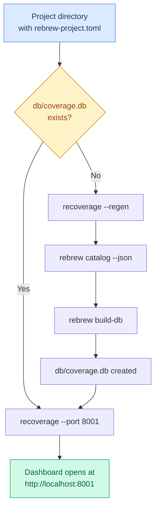
```mermaid
graph TD
    A["Project directory<br/>with rebrew-project.toml"] --> B{"db/coverage.db<br/>exists?"}
    B -->|Yes| C["recoverage --port 8001"]
    B -->|No| D["recoverage --regen"]
    D --> E["rebrew catalog --json"]
    E --> F["rebrew build-db"]
    F --> G["db/coverage.db created"]
    G --> C
    C --> H["Dashboard opens at<br/>http://localhost:8001"]

    style A fill:#dbeafe,stroke:#3b82f6,color:#1e3a5f
    style H fill:#d1fae5,stroke:#059669,color:#065f46
    style B fill:#fef3c7,stroke:#d97706,color:#92400e
```

---

## 2. Exploring the Coverage Grid

> **As an RE Dev**, I want to see a defrag-style grid where each cell represents a chunk of the binary so that I can instantly spot which areas are matched, partially matched, or still stubs.

### Acceptance Criteria
- Grid cells colored by match status: Exact (green), Reloc (blue), Matching (yellow), Stub (red), ASM (purple), None (gray)
- Grid is square and responsive (cells stay square via `ResizeObserver`)
- Section tabs (`.text`, `.rdata`, `.data`, `.bss`) switch views instantly (cached grids)
- Grids built via fast HTML string injection; tab switching toggles `display: none`

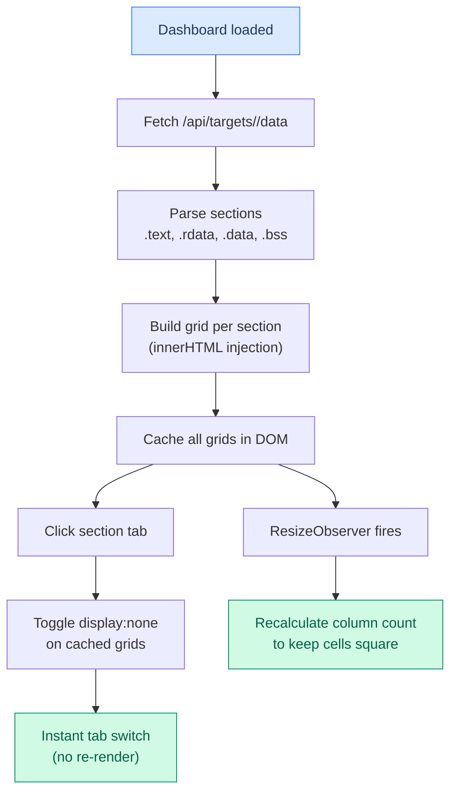
```mermaid
graph TD
    A["Dashboard loaded"] --> B["Fetch /api/targets/<target>/data"]
    B --> C["Parse sections<br/>.text, .rdata, .data, .bss"]
    C --> D["Build grid per section<br/>(innerHTML injection)"]
    D --> E["Cache all grids in DOM"]

    E --> F["Click section tab"]
    F --> G["Toggle display:none<br/>on cached grids"]
    G --> H["Instant tab switch<br/>(no re-render)"]

    E --> I["ResizeObserver fires"]
    I --> J["Recalculate column count<br/>to keep cells square"]

    style A fill:#dbeafe,stroke:#3b82f6,color:#1e3a5f
    style H fill:#d1fae5,stroke:#059669,color:#065f46
    style J fill:#d1fae5,stroke:#059669,color:#065f46
```

---

## 3. Inspecting a Function

> **As an RE Dev**, I want to click a cell in the grid and see the function's metadata, C source, disassembly, and hex dump side-by-side so that I can evaluate match quality without leaving the dashboard.

### Acceptance Criteria
- Side panel shows: VA, size, offset, symbol, status, origin, cflags, marker type
- C source fetched from project files and syntax-highlighted
- ASM generated on-demand via Capstone (`/api/targets/<target>/asm`)
- Original bytes formatted as hex dump (16 bytes/line)
- Copy VA, Copy Symbol, and Copy-to-clipboard buttons work
- Open/expand button launches a modal for full viewing

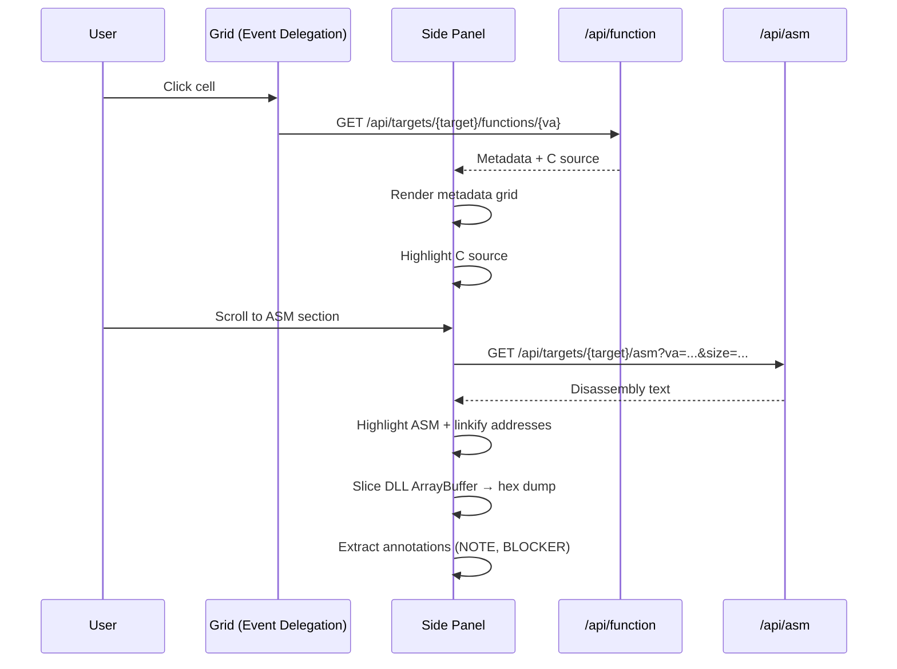
```mermaid
sequenceDiagram
    participant U as User
    participant Grid as Grid (Event Delegation)
    participant Panel as Side Panel
    participant API as /api/function
    participant ASM as /api/asm

    U->>Grid: Click cell
    Grid->>API: GET /api/targets/{target}/functions/{va}
    API-->>Panel: Metadata + C source
    Panel->>Panel: Render metadata grid
    Panel->>Panel: Highlight C source

    U->>Panel: Scroll to ASM section
    Panel->>ASM: GET /api/targets/{target}/asm?va=...&size=...
    ASM-->>Panel: Disassembly text
    Panel->>Panel: Highlight ASM + linkify addresses

    Panel->>Panel: Slice DLL ArrayBuffer → hex dump
    Panel->>Panel: Extract annotations (NOTE, BLOCKER)
```

---

## 4. Filtering by Match Status

> **As a Project Lead**, I want to filter the grid to show only specific match statuses so that I can focus on stubs that need work or celebrate exact matches.

### Acceptance Criteria
- Filter buttons: All, E (Exact), R (Reloc), M (Matching), S (Stub)
- Filters are set-based toggles (multiple can be active simultaneously)
- Non-matching cells are dimmed (opacity 0.15), not hidden, preserving spatial layout
- Filtering handled entirely by CSS classes on the parent container (no JS loops)
- Progress bar segments are clickable to quick-filter by status

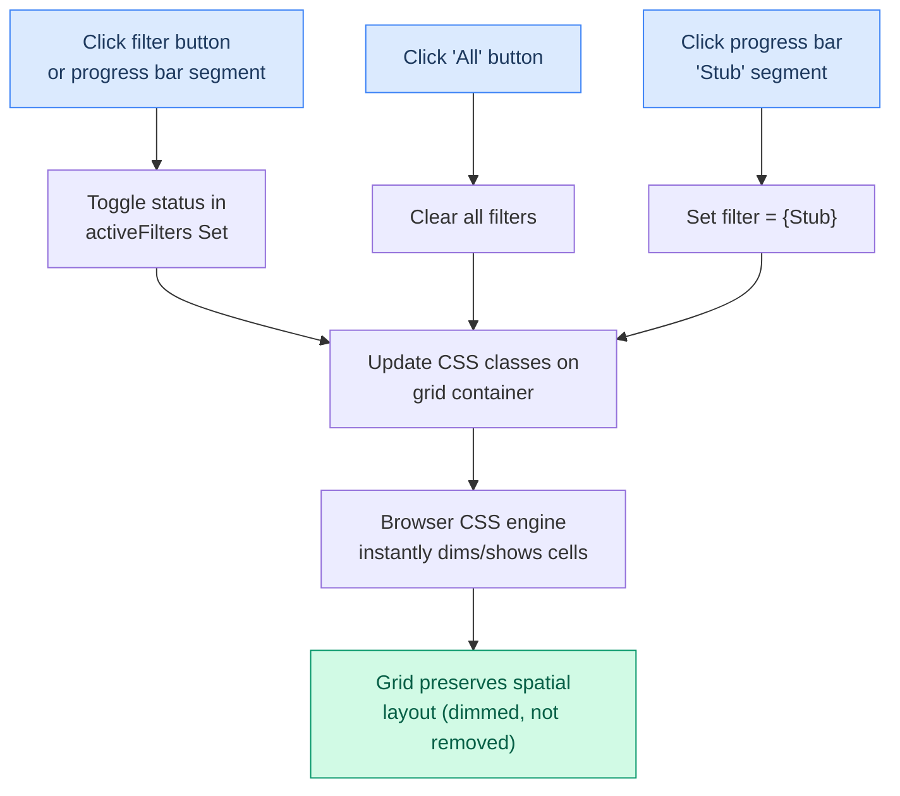
```mermaid
graph TD
    A["Click filter button<br/>or progress bar segment"] --> B["Toggle status in<br/>activeFilters Set"]
    B --> C["Update CSS classes on<br/>grid container"]
    C --> D["Browser CSS engine<br/>instantly dims/shows cells"]

    E["Click 'All' button"] --> F["Clear all filters"]
    F --> C

    G["Click progress bar<br/>'Stub' segment"] --> H["Set filter = {Stub}"]
    H --> C

    D --> I["Grid preserves spatial<br/>layout (dimmed, not removed)"]

    style A fill:#dbeafe,stroke:#3b82f6,color:#1e3a5f
    style E fill:#dbeafe,stroke:#3b82f6,color:#1e3a5f
    style G fill:#dbeafe,stroke:#3b82f6,color:#1e3a5f
    style I fill:#d1fae5,stroke:#059669,color:#065f46
```

---

## 5. Searching for Functions

> **As a Contributor**, I want to search for a function by name, VA, or symbol so that I can quickly locate it in the grid without scrolling through thousands of cells.

### Acceptance Criteria
- Search matches against function name, VA (hex), and symbol (case-insensitive)
- Search is debounced (250ms) to avoid excessive re-renders
- Non-matching cells are dimmed, matching cells highlighted
- Clearing the search restores all cells to normal

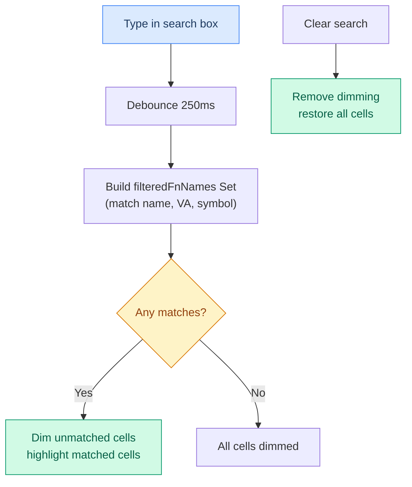
```mermaid
graph TD
    A["Type in search box"] --> B["Debounce 250ms"]
    B --> C["Build filteredFnNames Set<br/>(match name, VA, symbol)"]
    C --> D{"Any matches?"}
    D -->|Yes| E["Dim unmatched cells<br/>highlight matched cells"]
    D -->|No| F["All cells dimmed"]

    G["Clear search"] --> H["Remove dimming<br/>restore all cells"]

    style A fill:#dbeafe,stroke:#3b82f6,color:#1e3a5f
    style E fill:#d1fae5,stroke:#059669,color:#065f46
    style H fill:#d1fae5,stroke:#059669,color:#065f46
    style D fill:#fef3c7,stroke:#d97706,color:#92400e
```

---

## 6. Navigating Cross-References

> **As an RE Dev**, I want to click hex addresses in the disassembly to jump to the referenced function so that I can trace call chains without manual lookups.

### Acceptance Criteria
- Hex addresses in ASM (e.g. `0x10003DA0`) are rendered as clickable `<a>` links
- VA field in the metadata grid is also a clickable link
- Clicking an address switches to the correct section tab
- Target cell is selected, side panel updated, and grid scrolls into view

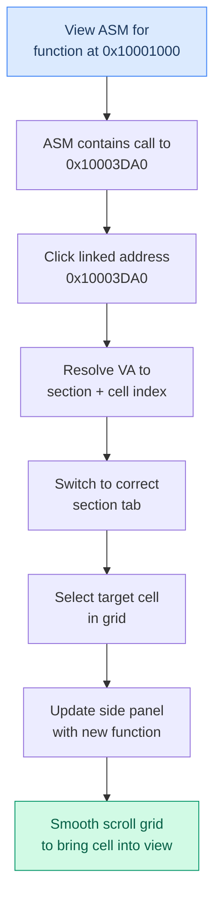
```mermaid
graph TD
    A["View ASM for<br/>function at 0x10001000"] --> B["ASM contains call to<br/>0x10003DA0"]
    B --> C["Click linked address<br/>0x10003DA0"]
    C --> D["Resolve VA to<br/>section + cell index"]
    D --> E["Switch to correct<br/>section tab"]
    E --> F["Select target cell<br/>in grid"]
    F --> G["Update side panel<br/>with new function"]
    G --> H["Smooth scroll grid<br/>to bring cell into view"]

    style A fill:#dbeafe,stroke:#3b82f6,color:#1e3a5f
    style H fill:#d1fae5,stroke:#059669,color:#065f46
```

---

## 7. Switching Between Targets

> **As a Project Lead**, I want to switch between targets (e.g. server.dll, client.exe) in a single dashboard session so that I can compare coverage across binaries.

### Acceptance Criteria
- Target selector dropdown populated from `/api/targets`
- Selection persisted to URL (`?target=XXX`) and `localStorage`
- Switching targets fetches new data, rebuilds grids, and resets panel
- Loading overlay shown during data fetch

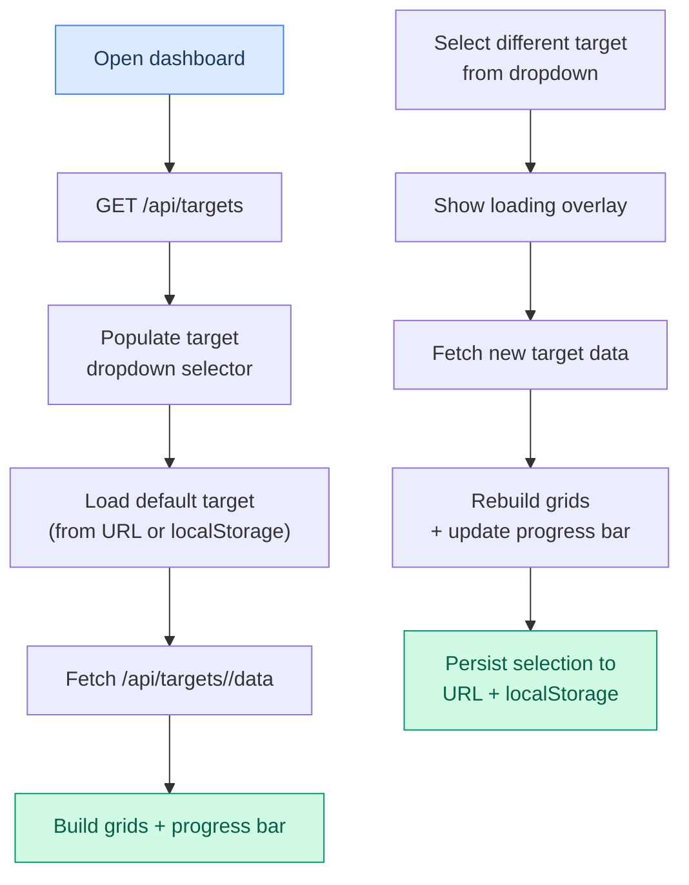
```mermaid
graph TD
    A["Open dashboard"] --> B["GET /api/targets"]
    B --> C["Populate target<br/>dropdown selector"]
    C --> D["Load default target<br/>(from URL or localStorage)"]
    D --> E["Fetch /api/targets/<target>/data"]
    E --> F["Build grids + progress bar"]

    G["Select different target<br/>from dropdown"] --> H["Show loading overlay"]
    H --> I["Fetch new target data"]
    I --> J["Rebuild grids<br/>+ update progress bar"]
    J --> K["Persist selection to<br/>URL + localStorage"]

    style A fill:#dbeafe,stroke:#3b82f6,color:#1e3a5f
    style F fill:#d1fae5,stroke:#059669,color:#065f46
    style K fill:#d1fae5,stroke:#059669,color:#065f46
```

---

## 8. Reading the Progress Bar

> **As a Project Lead**, I want an at-a-glance progress bar showing coverage percentages by status so that I can track decompilation progress without counting cells.

### Acceptance Criteria
- Segmented progress bar with Exact (green), Reloc (blue), Matching (yellow), Stub (red)
- Coverage stats overlaid: total bytes, matched bytes, percentage
- Each segment is clickable to filter the grid by that status
- Stats are precomputed in the DB and served via API

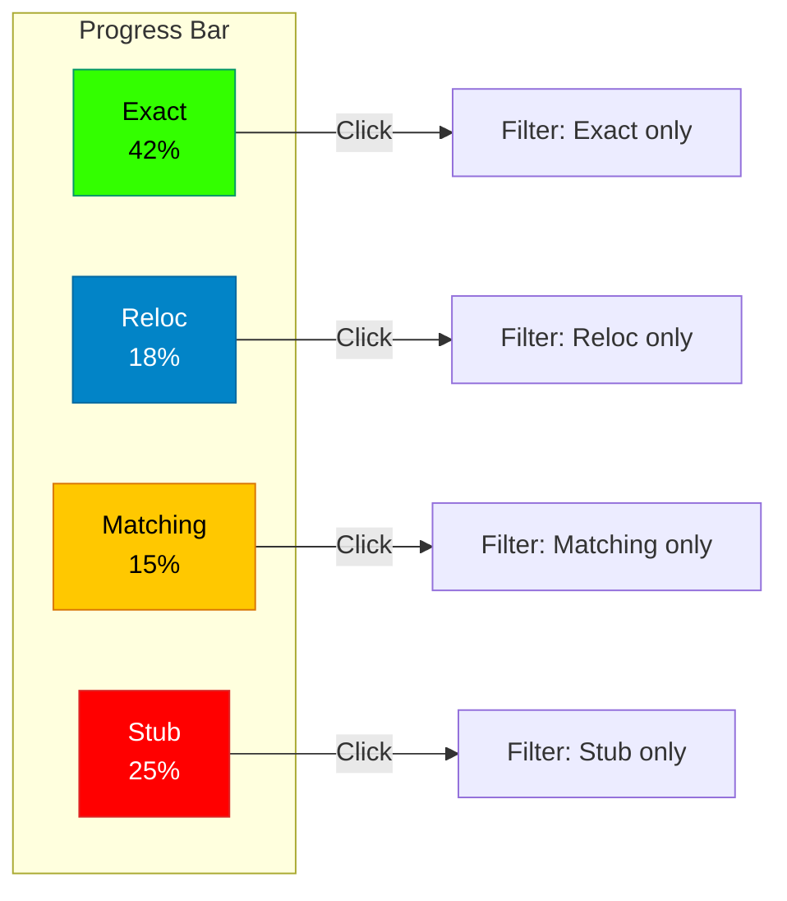
```mermaid
graph LR
    subgraph "Progress Bar"
        E["Exact<br/>42%"]
        R["Reloc<br/>18%"]
        M["Matching<br/>15%"]
        S["Stub<br/>25%"]
    end

    E -->|Click| FE["Filter: Exact only"]
    R -->|Click| FR["Filter: Reloc only"]
    M -->|Click| FM["Filter: Matching only"]
    S -->|Click| FS["Filter: Stub only"]

    style E fill:#33ff00,stroke:#059669,color:#000
    style R fill:#0284c7,stroke:#0369a1,color:#fff
    style M fill:#ffc800,stroke:#d97706,color:#000
    style S fill:#ff0000,stroke:#dc2626,color:#fff
```

---

## 9. Switching Themes

> **As a Contributor**, I want to toggle between dark and light themes so that I can use the dashboard comfortably in any lighting condition.

### Acceptance Criteria
- Dark mode (default): retro CRT aesthetic with scanline overlay and cyan glow
- Light mode: softer grays for reduced eye strain
- Toggle via sun/moon icon button in the topbar
- Preference persisted to `localStorage` (`recoverage_theme`)
- Falls back to `prefers-color-scheme` media query

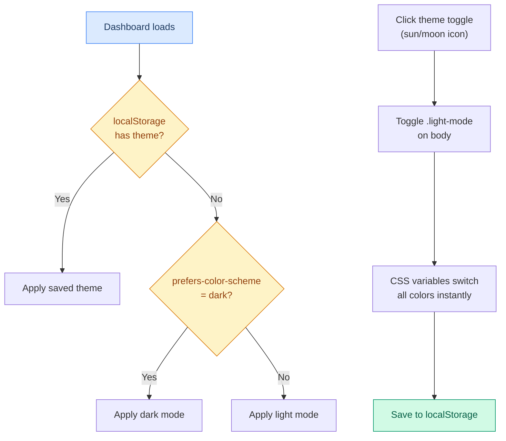
```mermaid
graph TD
    A["Dashboard loads"] --> B{"localStorage<br/>has theme?"}
    B -->|Yes| C["Apply saved theme"]
    B -->|No| D{"prefers-color-scheme<br/>= dark?"}
    D -->|Yes| E["Apply dark mode"]
    D -->|No| F["Apply light mode"]

    G["Click theme toggle<br/>(sun/moon icon)"] --> H["Toggle .light-mode<br/>on body"]
    H --> I["CSS variables switch<br/>all colors instantly"]
    I --> J["Save to localStorage"]

    style A fill:#dbeafe,stroke:#3b82f6,color:#1e3a5f
    style J fill:#d1fae5,stroke:#059669,color:#065f46
    style B fill:#fef3c7,stroke:#d97706,color:#92400e
    style D fill:#fef3c7,stroke:#d97706,color:#92400e
```

---

## 10. Using Potato Mode

> **As a Contributor**, I want a zero-JavaScript, pure-HTML fallback so that I can view coverage on constrained environments, restricted browsers, or via SSH with a text browser.

### Acceptance Criteria
- Accessible at `/potato`
- No CSS, no JavaScript — all styling via HTML attributes (`bgcolor`, `border`, etc.)
- Full feature parity: grid, filters, search, section tabs, detail panel
- Multi-select filters via URL parameters
- W3C Nu HTML Validator compliant
- Syntax highlighting via Pygments (server-side `` tags)

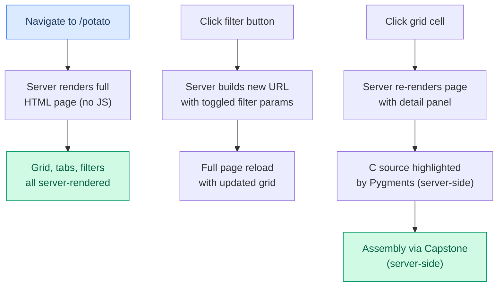
```mermaid
graph TD
    A["Navigate to /potato"] --> B["Server renders full<br/>HTML page (no JS)"]
    B --> C["Grid, tabs, filters<br/>all server-rendered"]

    D["Click filter button"] --> E["Server builds new URL<br/>with toggled filter params"]
    E --> F["Full page reload<br/>with updated grid"]

    G["Click grid cell"] --> H["Server re-renders page<br/>with detail panel"]
    H --> I["C source highlighted<br/>by Pygments (server-side)"]
    I --> J["Assembly via Capstone<br/>(server-side)"]

    style A fill:#dbeafe,stroke:#3b82f6,color:#1e3a5f
    style C fill:#d1fae5,stroke:#059669,color:#065f46
    style J fill:#d1fae5,stroke:#059669,color:#065f46
```

---

## 11. Live Regeneration

> **As an AI Operator**, I want to trigger a data rebuild from the dashboard so that after an overnight batch run I can refresh coverage without restarting the server.

### Acceptance Criteria
- Reload button in the topbar with a 5-second cooldown to prevent spam
- `POST /regen` triggers `rebrew catalog --json` + `rebrew build-db`
- Only accessible from localhost (security gate)
- Dashboard reloads data after regeneration completes
- ETag-based caching: if DB unchanged, API returns `304 Not Modified`

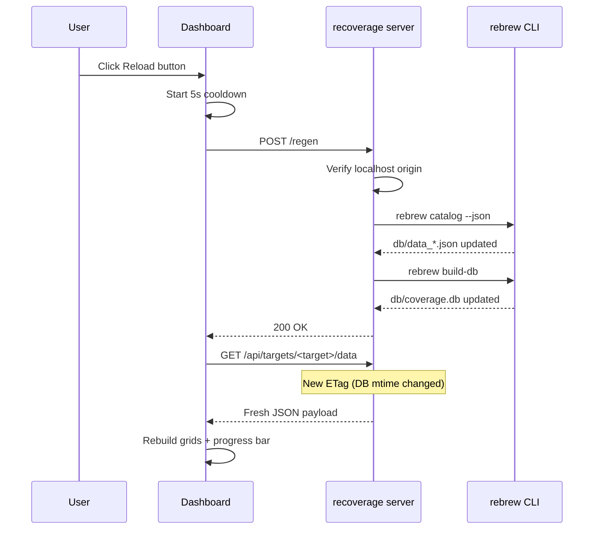
```mermaid
sequenceDiagram
    participant U as User
    participant UI as Dashboard
    participant Server as recoverage server
    participant Rebrew as rebrew CLI

    U->>UI: Click Reload button
    UI->>UI: Start 5s cooldown
    UI->>Server: POST /regen
    Server->>Server: Verify localhost origin

    Server->>Rebrew: rebrew catalog --json
    Rebrew-->>Server: db/data_*.json updated
    Server->>Rebrew: rebrew build-db
    Rebrew-->>Server: db/coverage.db updated

    Server-->>UI: 200 OK
    UI->>Server: GET /api/targets/<target>/data
    Note over Server: New ETag (DB mtime changed)
    Server-->>UI: Fresh JSON payload
    UI->>UI: Rebuild grids + progress bar
```

---

## 12. Inspecting Data Sections

> **As an RE Dev**, I want to inspect `.rdata`, `.data`, and `.bss` cells with a Data Inspector so that I can see how raw bytes interpret as integers, floats, and strings without a separate hex editor.

### Acceptance Criteria
- Data Inspector replaces ASM view for non-`.text` sections
- Interprets bytes as: int8, uint8, int16, uint16, int32, uint32, float32, float64, ASCII string
- Uses `DataView` on the client-side DLL ArrayBuffer (no backend round-trip)
- Hex dump still available alongside the Data Inspector
- Global variables show their declaration and linked source files

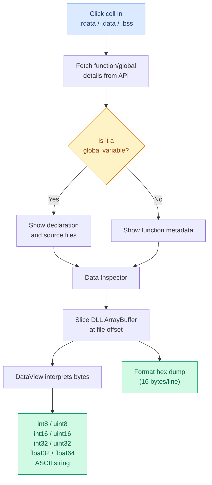
```mermaid
graph TD
    A["Click cell in<br/>.rdata / .data / .bss"] --> B["Fetch function/global<br/>details from API"]
    B --> C{"Is it a<br/>global variable?"}
    C -->|Yes| D["Show declaration<br/>and source files"]
    C -->|No| E["Show function metadata"]

    D --> F["Data Inspector"]
    E --> F

    F --> G["Slice DLL ArrayBuffer<br/>at file offset"]
    G --> H["DataView interprets bytes"]
    H --> I["int8 / uint8<br/>int16 / uint16<br/>int32 / uint32<br/>float32 / float64<br/>ASCII string"]

    G --> J["Format hex dump<br/>(16 bytes/line)"]

    style A fill:#dbeafe,stroke:#3b82f6,color:#1e3a5f
    style I fill:#d1fae5,stroke:#059669,color:#065f46
    style J fill:#d1fae5,stroke:#059669,color:#065f46
    style C fill:#fef3c7,stroke:#d97706,color:#92400e
```

---

## 13. Expanding Code in Modal View

> **As an RE Dev**, I want to expand C source, assembly, or hex dump into a full-screen modal so that I can study long functions without squinting in the side panel.

### Acceptance Criteria
- Each code block (C Source, ASM, Hex) has an "Open" button
- Modal is centered with backdrop blur and smooth scale/fade animation
- Copy button available inside the modal
- Close via button, Escape key, or clicking outside
- Custom-built with plain VanJS divs (no external UI library)

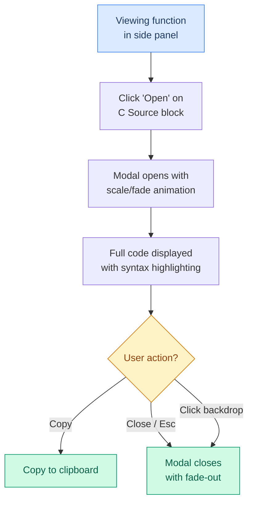
```mermaid
graph TD
    A["Viewing function<br/>in side panel"] --> B["Click 'Open' on<br/>C Source block"]
    B --> C["Modal opens with<br/>scale/fade animation"]
    C --> D["Full code displayed<br/>with syntax highlighting"]
    D --> E{"User action?"}
    E -->|"Copy"| F["Copy to clipboard"]
    E -->|"Close / Esc"| G["Modal closes<br/>with fade-out"]
    E -->|"Click backdrop"| G

    style A fill:#dbeafe,stroke:#3b82f6,color:#1e3a5f
    style F fill:#d1fae5,stroke:#059669,color:#065f46
    style G fill:#d1fae5,stroke:#059669,color:#065f46
    style E fill:#fef3c7,stroke:#d97706,color:#92400e
```

---

## 14. Responsive Layout

> **As a Contributor**, I want the dashboard to adapt to narrow screens so that I can use it on a laptop without horizontal scrolling.

### Acceptance Criteria
- Two-column layout (grid + panel) on wide screens (≥1300px)
- Single-column stacked layout on narrow screens (<1300px)
- Grid cells remain square regardless of viewport width
- Custom scrollbars styled to match the active theme
- `scrollbar-gutter: stable` prevents layout shifts on code blocks

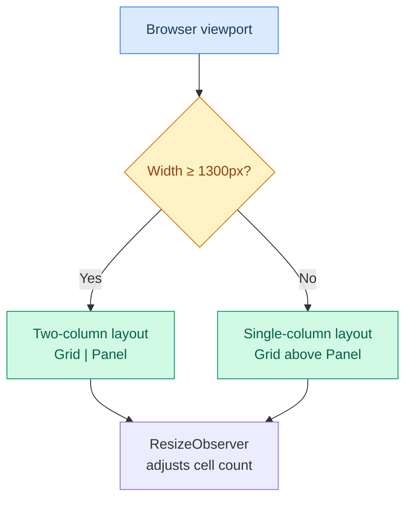
```mermaid
graph TD
    A["Browser viewport"] --> B{"Width ≥ 1300px?"}
    B -->|Yes| C["Two-column layout<br/>Grid | Panel"]
    B -->|No| D["Single-column layout<br/>Grid above Panel"]
    C --> E["ResizeObserver<br/>adjusts cell count"]
    D --> E

    style A fill:#dbeafe,stroke:#3b82f6,color:#1e3a5f
    style C fill:#d1fae5,stroke:#059669,color:#065f46
    style D fill:#d1fae5,stroke:#059669,color:#065f46
    style B fill:#fef3c7,stroke:#d97706,color:#92400e
```

---

## 15. Viewing Source Files

> **As an RE Dev**, I want to click source links in the detail panel to view the original `.c` files so that I can cross-reference the dashboard with the actual decompiled code.

### Acceptance Criteria
- Source links in the panel point to `/src/<target>/<file>.c`
- Server proxies `/src/*` and `/original/*` from the project directory (path-traversal safe)
- Original DLL bytes fetched via `/original/<target>.dll` as ArrayBuffer
- File offset calculated from VA using section metadata

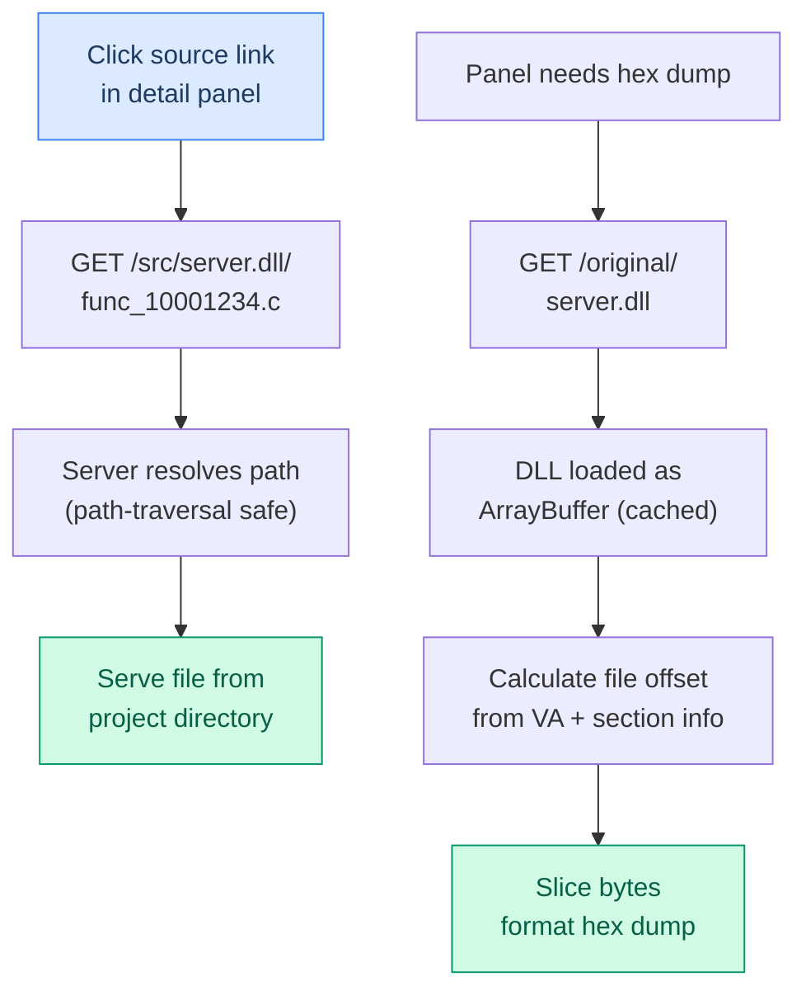
```mermaid
graph TD
    A["Click source link<br/>in detail panel"] --> B["GET /src/server.dll/<br/>func_10001234.c"]
    B --> C["Server resolves path<br/>(path-traversal safe)"]
    C --> D["Serve file from<br/>project directory"]

    E["Panel needs hex dump"] --> F["GET /original/<br/>server.dll"]
    F --> G["DLL loaded as<br/>ArrayBuffer (cached)"]
    G --> H["Calculate file offset<br/>from VA + section info"]
    H --> I["Slice bytes<br/>format hex dump"]

    style A fill:#dbeafe,stroke:#3b82f6,color:#1e3a5f
    style D fill:#d1fae5,stroke:#059669,color:#065f46
    style I fill:#d1fae5,stroke:#059669,color:#065f46
```

---

## 16. Performance-Optimized First Load

> **As an AI Operator**, I want the dashboard to render on the first TCP packet so that even over high-latency connections the UI shell appears instantly.

### Acceptance Criteria
- HTML, CSS, JS, and VanJS library inlined into a single response
- Minified with `rjsmin`/`rcssmin` and compressed with Brotli/Zstd/gzip
- Total payload ~14.5 KB (fits in TCP initial congestion window)
- Compression algorithm auto-selected from `Accept-Encoding` header
- Deferred Highlight.js loading: CDN fetch only on first code block click
- `AbortController` cancels in-flight requests when clicking rapidly between cells
- ETag caching returns `304 Not Modified` when DB is unchanged

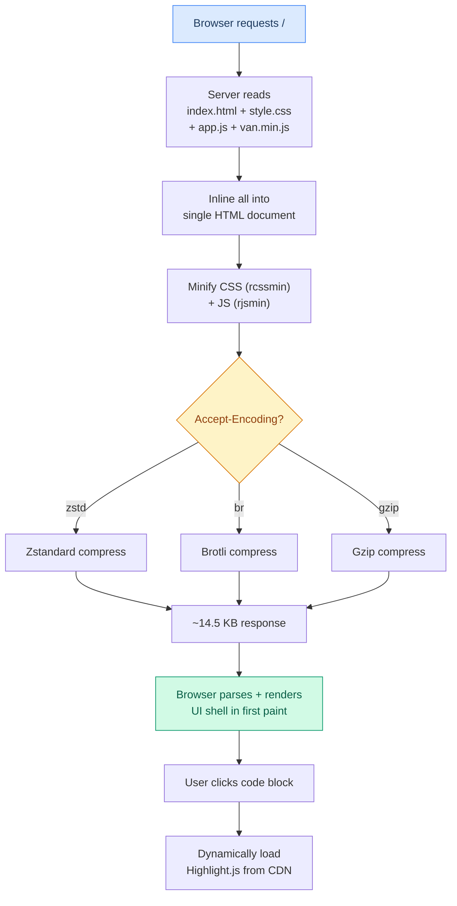
```mermaid
graph TD
    A["Browser requests /"] --> B["Server reads<br/>index.html + style.css<br/>+ app.js + van.min.js"]
    B --> C["Inline all into<br/>single HTML document"]
    C --> D["Minify CSS (rcssmin)<br/>+ JS (rjsmin)"]
    D --> E{"Accept-Encoding?"}
    E -->|zstd| F["Zstandard compress"]
    E -->|br| G["Brotli compress"]
    E -->|gzip| H["Gzip compress"]
    F --> I["~14.5 KB response"]
    G --> I
    H --> I
    I --> J["Browser parses + renders<br/>UI shell in first paint"]

    J --> K["User clicks code block"]
    K --> L["Dynamically load<br/>Highlight.js from CDN"]

    style A fill:#dbeafe,stroke:#3b82f6,color:#1e3a5f
    style J fill:#d1fae5,stroke:#059669,color:#065f46
    style E fill:#fef3c7,stroke:#d97706,color:#92400e
```

---

## Future Features

> Features tracked in [DESIGN.md](file:///home/maci/Desktop/refactor/recoverage/docs/DESIGN.md) as planned work.

| Feature | Description |
|---------|-------------|
| **Minimap** | A global minimap of the entire PE file on the side |
| **XREFs** | Show cross-references for data segments (which functions read/write to a `.data` block) |
| **Diff View** | Integrate `rebrew-match --diff` output directly into the UI for "Matching" and "Stub" blocks |

---

## End-to-End Dashboard Workflow

> **As an RE Dev**, I want to go from project setup to visual coverage tracking in a single streamlined workflow.

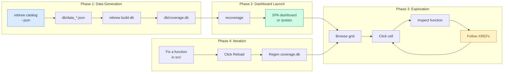
```mermaid
graph LR
    subgraph "Phase 1: Data Generation"
        A["rebrew catalog<br/>--json"] --> B["db/data_*.json"]
        B --> C["rebrew build-db"]
        C --> D["db/coverage.db"]
    end

    subgraph "Phase 2: Dashboard Launch"
        D --> E["recoverage"]
        E --> F["SPA dashboard<br/>or /potato"]
    end

    subgraph "Phase 3: Exploration"
        F --> G["Browse grid"]
        G --> H["Click cell"]
        H --> I["Inspect function"]
        I --> J["Follow XREFs"]
        J --> H
    end

    subgraph "Phase 4: Iteration"
        K["Fix a function<br/>in src/"] --> L["Click Reload"]
        L --> M["Regen coverage.db"]
        M --> G
    end

    style A fill:#dbeafe,stroke:#3b82f6,color:#1e3a5f
    style F fill:#d1fae5,stroke:#059669,color:#065f46
    style J fill:#fef3c7,stroke:#d97706,color:#92400e
```
