# User Stories & Workflow Diagrams

User stories for the **recoverage** coverage dashboard, organized by persona and workflow.

What the dashboard must do, one story per workflow, each with acceptance criteria
that the shipped code satisfies. How it is built is [DESIGN.md](DESIGN.md); the
attack surface is [THREAT_MODEL.md](THREAT_MODEL.md). Last verified against the
code: 2026-09-29.

---

## Personas

| Persona | Description |
|---------|-------------|
| **RE Dev** | A reverse engineer actively decompiling functions and inspecting match results |
| **AI Operator** | Someone running AI-assisted batch pipelines who needs quick coverage visibility |
| **Project Lead** | Sets up projects, reviews progress, manages targets across binaries |
| **Contributor** | New team member learning the workflow and exploring the codebase |

---

## 1. Launching the Dashboard

> **As an RE Dev**, I want to start the coverage dashboard from my project directory so that I can visually inspect progress without reading raw JSON.

### Acceptance Criteria
- `recoverage serve` serves a local web dashboard on port 8001
- Dashboard auto-opens in the default browser (`recoverage serve --no-open` suppresses it)
- Server resolves the coverage directory from the current working directory: `[project] db_dir` in `rebrew-project.toml` when set, falling back to `db/`; the directory must hold at least one `coverage-<target>.toml` document
- `--regen` flag runs rebrew's catalog + build-db (in-process, via `rebrew.catalog` / `rebrew.build_db`) before starting
- `--no-open` flag suppresses the browser auto-open

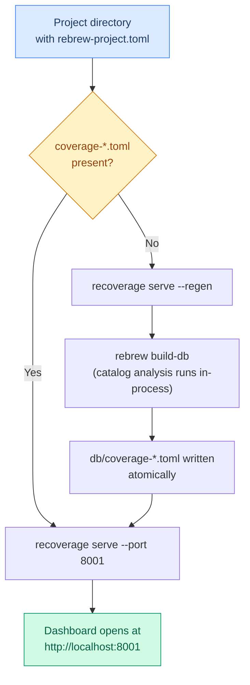
```mermaid
graph TD
    A["Project directory<br/>with rebrew-project.toml"] --> B{"coverage-*.toml<br/>present?"}
    B -->|Yes| C["recoverage serve --port 8001"]
    B -->|No| D["recoverage serve --regen"]
    D --> E["rebrew build-db<br/>(catalog analysis runs in-process)"]
    E --> F["db/coverage-*.toml written<br/>atomically"]
    F --> C
    C --> H["Dashboard opens at<br/>http://localhost:8001"]

    style A fill:#dbeafe,stroke:#3b82f6,color:#1e3a5f
    style H fill:#d1fae5,stroke:#059669,color:#065f46
    style B fill:#fef3c7,stroke:#d97706,color:#92400e
```

---

## 2. Exploring the Coverage Grid

> **As an RE Dev**, I want to see a defrag-style grid where each cell represents a chunk of the binary so that I can instantly spot which areas are matched, partially matched, or still stubs.

### Acceptance Criteria
- Grid cells colored by match status: Exact (green), Reloc (blue), Near-match (yellow), Proven (cyan), Size mismatch (yellow), Stub (red), Padding (silver), Problem (violet), None (gray); data and thunk cells render as undocumented (gray)
- Grid cells stay square: a `ResizeObserver` triggers a relayout that resizes cells (floor 6px desktop, 12px under 700px), and the section's declared column count is never reduced
- Section tabs (`.text`, `.rdata`, `.data`, `.bss`) switch views instantly (cached layouts)
- A section's cells are fetched on first visit; the map area says the cells are loading, and a failed fetch says what went wrong and offers a Retry
- Hovering a cell names its address range, match state, and function
- Grids painted to a per-section canvas; layout cached, only the active section repaints

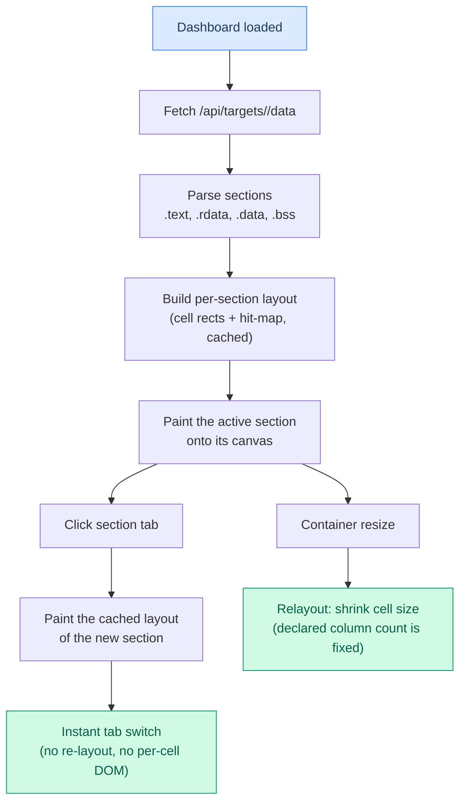
```mermaid
graph TD
    A["Dashboard loaded"] --> B["Fetch /api/targets/<target>/data"]
    B --> C["Parse sections<br/>.text, .rdata, .data, .bss"]
    C --> D["Build per-section layout<br/>(cell rects + hit-map, cached)"]
    D --> E["Paint the active section<br/>onto its canvas"]

    E --> F["Click section tab"]
    F --> G["Paint the cached layout<br/>of the new section"]
    G --> H["Instant tab switch<br/>(no re-layout, no per-cell DOM)"]

    E --> I["Container resize"]
    I --> J["Relayout: shrink cell size<br/>(declared column count is fixed)"]

    style A fill:#dbeafe,stroke:#3b82f6,color:#1e3a5f
    style H fill:#d1fae5,stroke:#059669,color:#065f46
    style J fill:#d1fae5,stroke:#059669,color:#065f46
```

---

## 3. Inspecting a Function

> **As an RE Dev**, I want to click a cell in the grid and see the function's metadata, C source, disassembly, and hex dump side-by-side so that I can evaluate match quality without leaving the dashboard.

### Acceptance Criteria
- Side panel shows: VA, size, offset, symbol, status, module, cflags, marker type
- C source fetched from project files and syntax-highlighted
- ASM generated on-demand via Capstone (`/api/targets/<target>/asm`)
- Original bytes formatted as hex dump (16 bytes/line)
- Copy VA, Copy Symbol, and Copy-to-clipboard buttons work
- Open/expand button launches a modal for full viewing

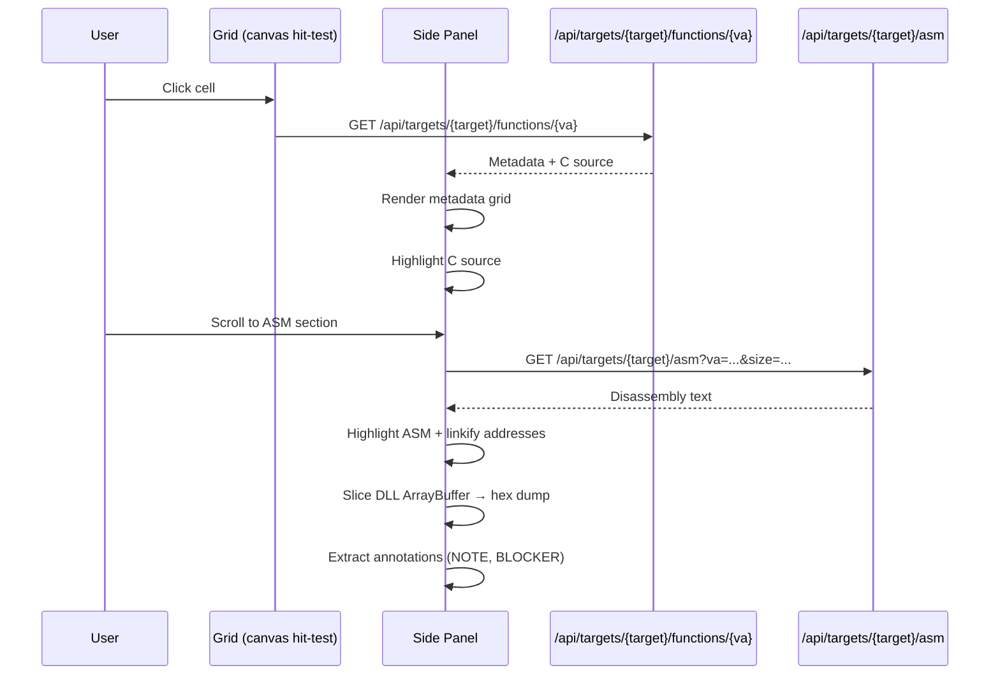
```mermaid
sequenceDiagram
    participant U as User
    participant Grid as Grid (canvas hit-test)
    participant Panel as Side Panel
    participant API as /api/targets/{target}/functions/{va}
    participant ASM as /api/targets/{target}/asm

    U->>Grid: Click cell
    Grid->>API: GET /api/targets/{target}/functions/{va}
    API-->>Panel: Metadata + C source
    Panel->>Panel: Render metadata grid
    Panel->>Panel: Highlight C source

    U->>Panel: Scroll to ASM section
    Panel->>ASM: GET /api/targets/{target}/asm?va=...&size=...
    ASM-->>Panel: Disassembly text
    Panel->>Panel: Highlight ASM + linkify addresses

    Panel->>Panel: Slice DLL ArrayBuffer → hex dump
    Panel->>Panel: Extract annotations (NOTE, BLOCKER)
```

---

## 4. Filtering by Match Status

> **As a Project Lead**, I want to filter the grid to show only specific match statuses so that I can focus on stubs that need work or celebrate exact matches.

### Acceptance Criteria
- Filter buttons: All, E (Exact), R (Reloc), M (Near-match), S (Stub), P (Padding), V (Proven), X (Problem)
- Filters are set-based toggles (multiple can be active simultaneously)
- Non-matching cells are dimmed (opacity 0.15), not hidden, preserving spatial layout
- Filtering is a second alpha pass over precomputed cell rects (no per-cell DOM, no CSS class toggling)
- Progress bar segments are clickable to quick-filter by status; a segment below 0.5% is not rendered

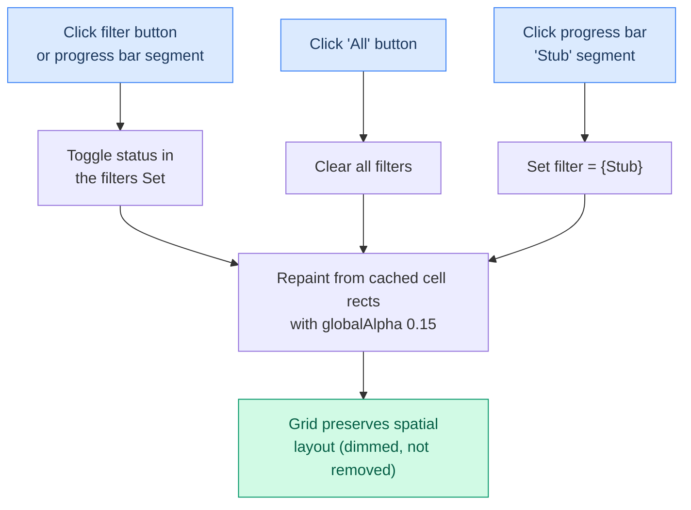
```mermaid
graph TD
    A["Click filter button<br/>or progress bar segment"] --> B["Toggle status in<br/>the filters Set"]
    B --> C["Repaint from cached cell rects<br/>with globalAlpha 0.15"]

    E["Click 'All' button"] --> F["Clear all filters"]
    F --> C

    G["Click progress bar<br/>'Stub' segment"] --> H["Set filter = {Stub}"]
    H --> C

    C --> I["Grid preserves spatial<br/>layout (dimmed, not removed)"]

    style A fill:#dbeafe,stroke:#3b82f6,color:#1e3a5f
    style E fill:#dbeafe,stroke:#3b82f6,color:#1e3a5f
    style G fill:#dbeafe,stroke:#3b82f6,color:#1e3a5f
    style I fill:#d1fae5,stroke:#059669,color:#065f46
```

---

## 5. Searching for Functions

> **As a Contributor**, I want to search for a function by name, VA, or symbol so that I can quickly locate it in the grid without scrolling through thousands of cells.

### Acceptance Criteria
- Search matches against function name, VA (hex), and symbol (case-insensitive)
- Matching is derived on each render from the payload's `search_index`, so a keystroke updates the map without a round trip
- Non-matching cells are dimmed, matching cells highlighted
- The search row reports the live match count, names the query, and says what
  to do when nothing matched; a Clear button empties the input
- Enter jumps to the first match, selecting the cell or jumping to its VA when the match is not in the active section
- Clearing the search restores all cells to normal

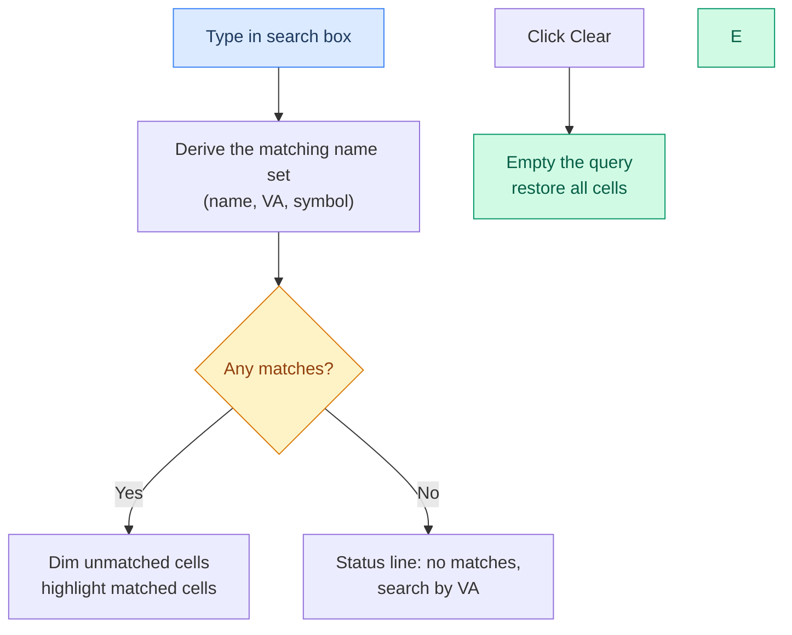
```mermaid
graph TD
    A["Type in search box"] --> B["Derive the matching name set<br/>(name, VA, symbol)"]
    B --> C{"Any matches?"}
    C -->|Yes| D["Dim unmatched cells<br/>highlight matched cells"]
    C -->|No| F["Status line: no matches,<br/>search by VA"]

    G["Click Clear"] --> H["Empty the query<br/>restore all cells"]

    style A fill:#dbeafe,stroke:#3b82f6,color:#1e3a5f
    style E fill:#d1fae5,stroke:#059669,color:#065f46
    style H fill:#d1fae5,stroke:#059669,color:#065f46
    style C fill:#fef3c7,stroke:#d97706,color:#92400e
```

---

## 6. Following Addresses

> **As an RE Dev**, I want to click a hex address in the disassembly to jump to the block that address names so that I can walk a call chain without a second lookup. (A data-segment cross-reference view, which is what a call graph is, is not built; see [DESIGN.md](DESIGN.md#future-ideas--todos).)

### Acceptance Criteria
- Hex addresses in ASM (e.g. `0x10003DA0`) are rendered as clickable `<a>` links
- VA field in the metadata grid is also a clickable link
- Clicking an address switches to the correct section tab
- Target cell is selected, side panel updated, and grid scrolls into view

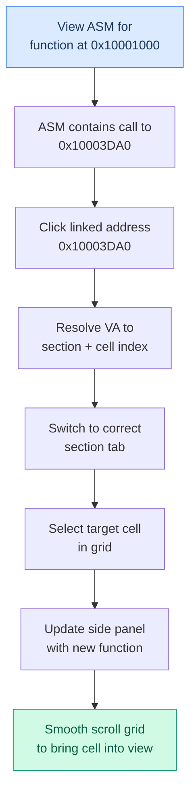
```mermaid
graph TD
    A["View ASM for<br/>function at 0x10001000"] --> B["ASM contains call to<br/>0x10003DA0"]
    B --> C["Click linked address<br/>0x10003DA0"]
    C --> D["Resolve VA to<br/>section + cell index"]
    D --> E["Switch to correct<br/>section tab"]
    E --> F["Select target cell<br/>in grid"]
    F --> G["Update side panel<br/>with new function"]
    G --> H["Smooth scroll grid<br/>to bring cell into view"]

    style A fill:#dbeafe,stroke:#3b82f6,color:#1e3a5f
    style H fill:#d1fae5,stroke:#059669,color:#065f46
```

---

## 7. Switching Between Targets

> **As a Project Lead**, I want to switch between targets (e.g. server.dll, client.exe) in a single dashboard session so that I can compare coverage across binaries.

### Acceptance Criteria
- Target selector dropdown populated from `/api/targets`
- Selection persisted to URL (`?target=XXX`) and `localStorage`
- Switching targets fetches new data, rebuilds grids, and resets panel
- The loading overlay is first-paint only: switching targets rebuilds in place rather than flashing the whole map (see 1.4.0 in the changelog)

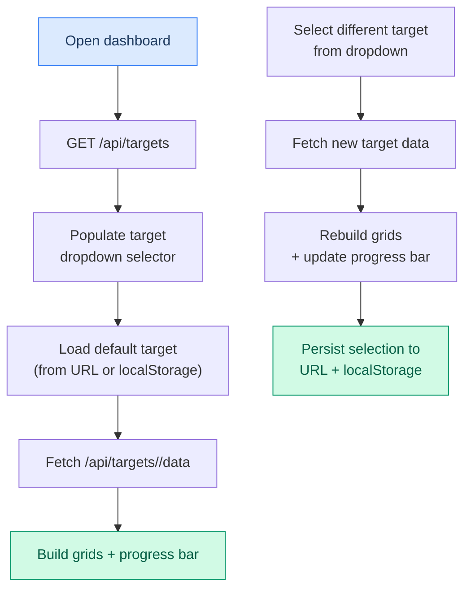
```mermaid
graph TD
    A["Open dashboard"] --> B["GET /api/targets"]
    B --> C["Populate target<br/>dropdown selector"]
    C --> D["Load default target<br/>(from URL or localStorage)"]
    D --> E["Fetch /api/targets/<target>/data"]
    E --> F["Build grids + progress bar"]

    G["Select different target<br/>from dropdown"] --> I["Fetch new target data"]
    I --> J["Rebuild grids<br/>+ update progress bar"]
    J --> K["Persist selection to<br/>URL + localStorage"]

    style A fill:#dbeafe,stroke:#3b82f6,color:#1e3a5f
    style F fill:#d1fae5,stroke:#059669,color:#065f46
    style K fill:#d1fae5,stroke:#059669,color:#065f46
```

---

## 8. Reading the Progress Bar

> **As a Project Lead**, I want an at-a-glance progress bar showing coverage percentages by status so that I can track decompilation progress without counting cells.

### Acceptance Criteria
- Segmented progress bar with Exact (green), Reloc (blue), Near-match (yellow), Stub (red), Padding (silver). All segments of a bar share one denominator: `.text` counts functions, every other section counts bytes, and Padding (a cell state) is a segment only on the byte-counted bars
- Coverage stats rendered as a text row above the bar (never inside it): total section bytes, matched cells, coverage %
- "Matched" counts exact + reloc cells only: a near-match is a miss and a stub is a stand-in
- Each segment is clickable to filter the grid by that status, and reachable by keyboard with `aria-pressed`
- Coverage stats are derived at load from the stored cells and functions and served via API

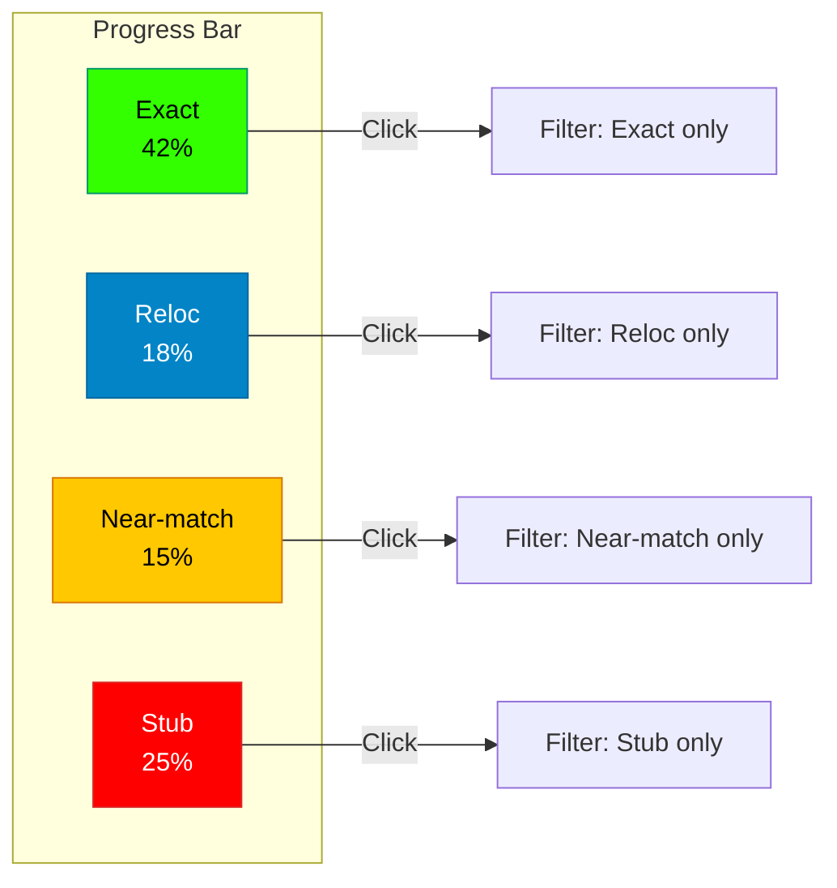
```mermaid
graph LR
    subgraph "Progress Bar"
        E["Exact<br/>42%"]
        R["Reloc<br/>18%"]
        M["Near-match<br/>15%"]
        S["Stub<br/>25%"]
    end

    E -->|Click| FE["Filter: Exact only"]
    R -->|Click| FR["Filter: Reloc only"]
    M -->|Click| FM["Filter: Near-match only"]
    S -->|Click| FS["Filter: Stub only"]

    style E fill:#33ff00,stroke:#059669,color:#000
    style R fill:#0284c7,stroke:#0369a1,color:#fff
    style M fill:#ffc800,stroke:#d97706,color:#000
    style S fill:#ff0000,stroke:#dc2626,color:#fff
```

> Padding is also a segment and filter button; it is left out of the diagram above only because the example percentages show the four dominant states.

---

## 9. Switching Themes

> **As a Contributor**, I want to toggle between dark and light themes so that I can use the dashboard comfortably in any lighting condition.

### Acceptance Criteria
- Dark mode (default): retro CRT aesthetic with scanline overlay and cyan glow
- Light mode: softer grays for reduced eye strain
- Toggle via sun/moon icon button in the topbar
- Preference persisted to `localStorage` (`recoverage_theme`)
- Falls back to `prefers-color-scheme` media query

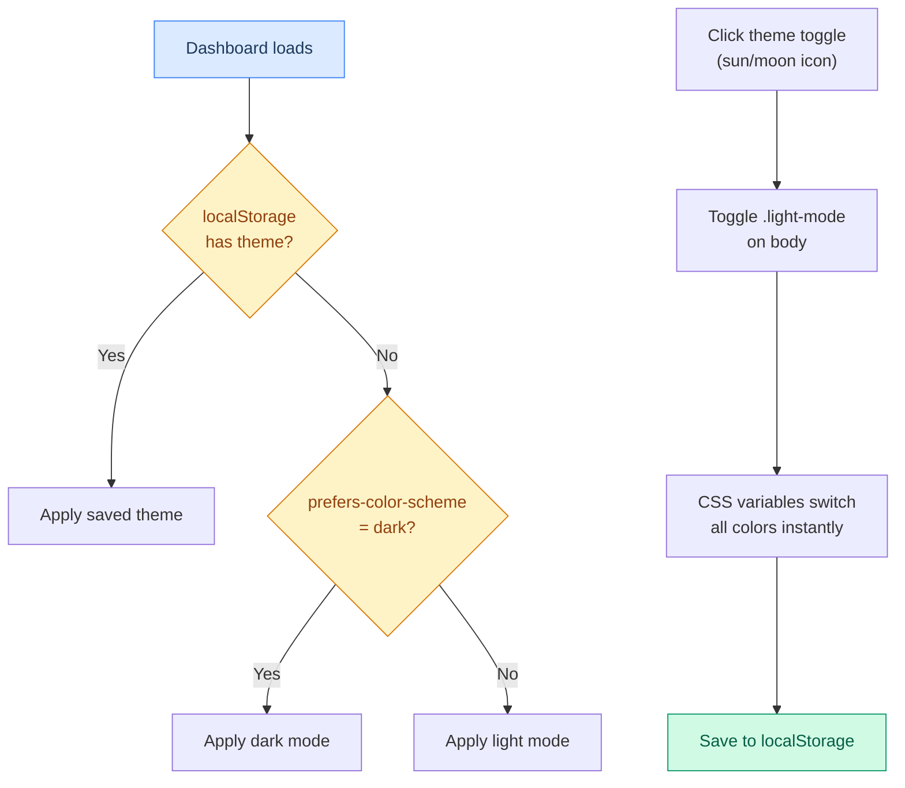
```mermaid
graph TD
    A["Dashboard loads"] --> B{"localStorage<br/>has theme?"}
    B -->|Yes| C["Apply saved theme"]
    B -->|No| D{"prefers-color-scheme<br/>= dark?"}
    D -->|Yes| E["Apply dark mode"]
    D -->|No| F["Apply light mode"]

    G["Click theme toggle<br/>(sun/moon icon)"] --> H["Toggle .light-mode<br/>on body"]
    H --> I["CSS variables switch<br/>all colors instantly"]
    I --> J["Save to localStorage"]

    style A fill:#dbeafe,stroke:#3b82f6,color:#1e3a5f
    style J fill:#d1fae5,stroke:#059669,color:#065f46
    style B fill:#fef3c7,stroke:#d97706,color:#92400e
    style D fill:#fef3c7,stroke:#d97706,color:#92400e
```

---

## 10. Using Potato Mode

> **As a Contributor**, I want a zero-JavaScript, pure-HTML fallback so that I can view coverage on constrained environments, restricted browsers, or via SSH with a text browser.

### Acceptance Criteria
- Accessible at `/potato`
- No CSS, no JavaScript — all styling via HTML attributes (`bgcolor`, `border`, etc.)
- Same surface as the SPA: grid, filters, search, section tabs, detail panel, data inspector, hex dump, assembly, globals, target selector
- The grid is paginated (32 rows per page, `?page=N`); a real `.text` section is ~25k cells, which unpaginated is ~7.7 MB of table markup
- `?view=functions` renders the function list (`?sort=name|va|size|status`, `?status=`) instead of the grid
- Multi-select filters via URL parameters
- W3C Nu HTML Validator compliant
- Syntax highlighting via Pygments (server-side `` tags)

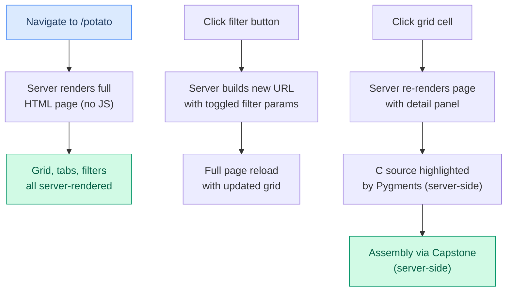
```mermaid
graph TD
    A["Navigate to /potato"] --> B["Server renders full<br/>HTML page (no JS)"]
    B --> C["Grid, tabs, filters<br/>all server-rendered"]

    D["Click filter button"] --> E["Server builds new URL<br/>with toggled filter params"]
    E --> F["Full page reload<br/>with updated grid"]

    G["Click grid cell"] --> H["Server re-renders page<br/>with detail panel"]
    H --> I["C source highlighted<br/>by Pygments (server-side)"]
    I --> J["Assembly via Capstone<br/>(server-side)"]

    style A fill:#dbeafe,stroke:#3b82f6,color:#1e3a5f
    style C fill:#d1fae5,stroke:#059669,color:#065f46
    style J fill:#d1fae5,stroke:#059669,color:#065f46
```

---

## 11. Live Regeneration

> **As an AI Operator**, I want to trigger a data rebuild from the dashboard so that after an overnight batch run I can refresh coverage without restarting the server.

### Acceptance Criteria
- Regenerate button in the topbar with a 5-second cooldown to prevent spam
- The button reads *Regenerating...* and is disabled for the duration of the run, so the click is acknowledged where it was made and a repeat click is a no-op
- The server enforces its own 5-second cooldown and serializes regen behind a lock, so a second caller gets `429` rather than a second build
- `POST /api/regen` runs rebrew's catalog + build-db in-process
- The Regenerate button sends a fresh `Idempotency-Key` per click; a key whose run already completed is replayed from a bounded ledger (`{"ok": true}`, `Idempotent-Replay: true`) instead of rebuilding, and a failed run is not remembered
- Only accessible from localhost (security gate)
- Dashboard reloads data after regeneration completes
- ETag-based caching: if the coverage documents are unchanged, API returns `304 Not Modified`

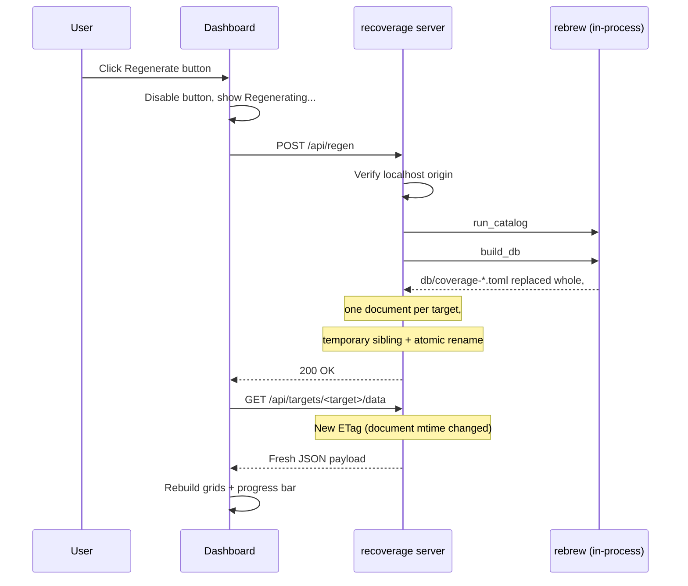
```mermaid
sequenceDiagram
    participant U as User
    participant UI as Dashboard
    participant Server as recoverage server
    participant Rebrew as rebrew (in-process)

    U->>UI: Click Regenerate button
    UI->>UI: Disable button, show Regenerating...
    UI->>Server: POST /api/regen
    Server->>Server: Verify localhost origin

    Server->>Rebrew: run_catalog
    Server->>Rebrew: build_db
    Rebrew-->>Server: db/coverage-*.toml replaced whole,
    Note over Server: one document per target,
    Note over Server: temporary sibling + atomic rename

    Server-->>UI: 200 OK
    UI->>Server: GET /api/targets/<target>/data
    Note over Server: New ETag (document mtime changed)
    Server-->>UI: Fresh JSON payload
    UI->>UI: Rebuild grids + progress bar
```

---

## 12. Inspecting Data Sections

> **As an RE Dev**, I want to inspect `.rdata`, `.data`, and `.bss` cells with a Data Inspector so that I can see how raw bytes interpret as integers, floats, and strings without a separate hex editor.

### Acceptance Criteria
- Data Inspector replaces ASM view for non-`.text` sections
- Interprets bytes as: int8, uint8, int16, uint16, int32, uint32, float32, float64, ASCII string
- Uses `DataView` on the client-side DLL ArrayBuffer (no backend round-trip)
- Hex dump still available alongside the Data Inspector
- Global variables show their declaration and linked source files

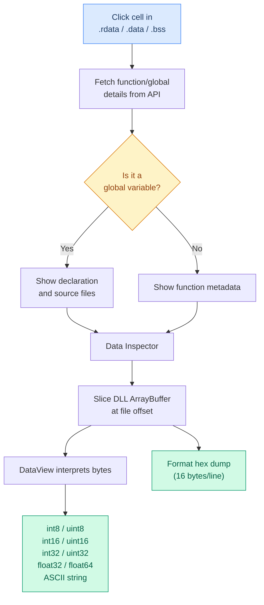
```mermaid
graph TD
    A["Click cell in<br/>.rdata / .data / .bss"] --> B["Fetch function/global<br/>details from API"]
    B --> C{"Is it a<br/>global variable?"}
    C -->|Yes| D["Show declaration<br/>and source files"]
    C -->|No| E["Show function metadata"]

    D --> F["Data Inspector"]
    E --> F

    F --> G["Slice DLL ArrayBuffer<br/>at file offset"]
    G --> H["DataView interprets bytes"]
    H --> I["int8 / uint8<br/>int16 / uint16<br/>int32 / uint32<br/>float32 / float64<br/>ASCII string"]

    G --> J["Format hex dump<br/>(16 bytes/line)"]

    style A fill:#dbeafe,stroke:#3b82f6,color:#1e3a5f
    style I fill:#d1fae5,stroke:#059669,color:#065f46
    style J fill:#d1fae5,stroke:#059669,color:#065f46
    style C fill:#fef3c7,stroke:#d97706,color:#92400e
```

---

## 13. Expanding Code in Modal View

> **As an RE Dev**, I want to expand C source, assembly, or hex dump into a full-screen modal so that I can study long functions without squinting in the side panel.

### Acceptance Criteria
- Each code block (C Source, ASM, Hex) has an "Open" button
- Modal is centered with backdrop blur and smooth scale/fade animation
- Copy button available inside the modal
- Close via button, Escape key, or clicking outside
- Custom-built dialog portaled into `document.body`, with the shadcn/ui `Button` primitive for its controls

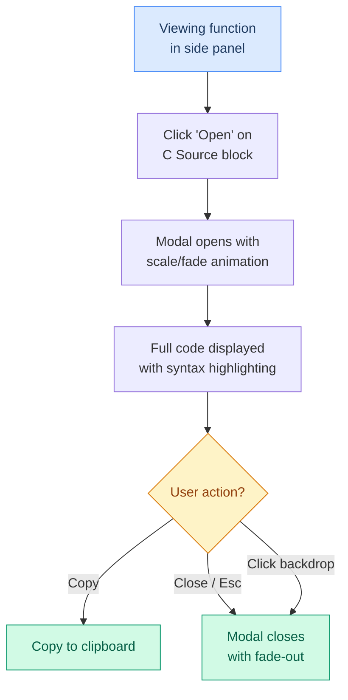
```mermaid
graph TD
    A["Viewing function<br/>in side panel"] --> B["Click 'Open' on<br/>C Source block"]
    B --> C["Modal opens with<br/>scale/fade animation"]
    C --> D["Full code displayed<br/>with syntax highlighting"]
    D --> E{"User action?"}
    E -->|"Copy"| F["Copy to clipboard"]
    E -->|"Close / Esc"| G["Modal closes<br/>with fade-out"]
    E -->|"Click backdrop"| G

    style A fill:#dbeafe,stroke:#3b82f6,color:#1e3a5f
    style F fill:#d1fae5,stroke:#059669,color:#065f46
    style G fill:#d1fae5,stroke:#059669,color:#065f46
    style E fill:#fef3c7,stroke:#d97706,color:#92400e
```

---

## 14. Responsive Layout

> **As a Contributor**, I want the dashboard to adapt to narrow screens so that I can use it on a laptop without horizontal scrolling.

### Acceptance Criteria
- Two-column layout (grid + panel) on wide screens (≥1300px)
- Single-column stacked layout on narrow screens (<1300px)
- Grid cells remain square regardless of viewport width
- Custom scrollbars styled to match the active theme
- `scrollbar-gutter: stable` prevents layout shifts on code blocks

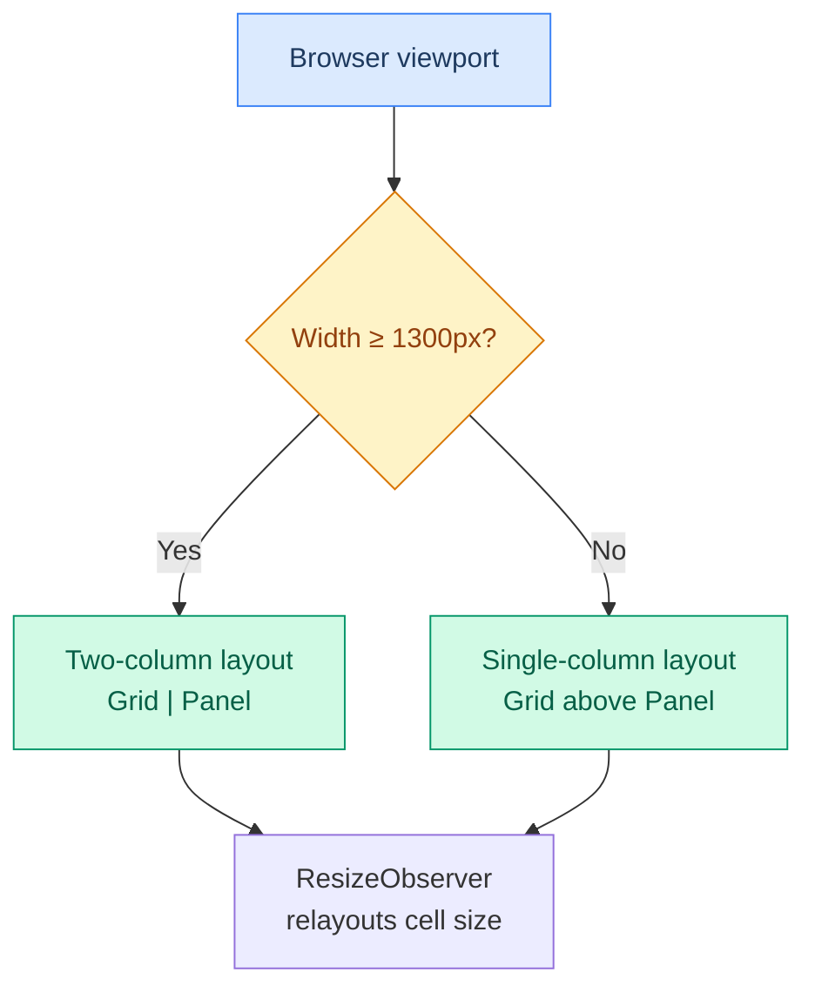
```mermaid
graph TD
    A["Browser viewport"] --> B{"Width ≥ 1300px?"}
    B -->|Yes| C["Two-column layout<br/>Grid | Panel"]
    B -->|No| D["Single-column layout<br/>Grid above Panel"]
    C --> E["ResizeObserver<br/>relayouts cell size"]
    D --> E

    style A fill:#dbeafe,stroke:#3b82f6,color:#1e3a5f
    style C fill:#d1fae5,stroke:#059669,color:#065f46
    style D fill:#d1fae5,stroke:#059669,color:#065f46
    style B fill:#fef3c7,stroke:#d97706,color:#92400e
```

---

## 15. Viewing Source Files

> **As an RE Dev**, I want to click source links in the detail panel to view the original `.c` files so that I can cross-reference the dashboard with the actual decompiled code.

### Acceptance Criteria
- Source links in the panel point at `paths.sourceRoot` from the document, falling back to `/src/<target>/<file>.c`
- Server proxies `/src/*` and `/original/*` from the project directory (path-traversal safe)
- Original DLL bytes are fetched from `paths.originalDll`, falling back to `/original/<target>.dll`, as an ArrayBuffer cached by `useOriginalBinary` against the resolved path
- A section with no file backing (or a `.bss` cell) has no bytes to slice, and the hex pane says so rather than showing unrelated bytes
- File offset calculated from VA using section metadata

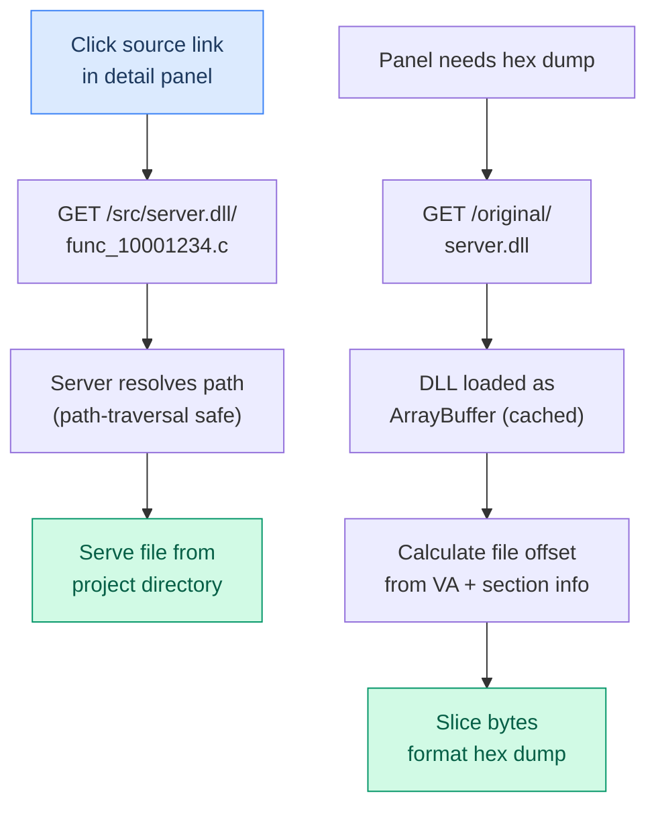
```mermaid
graph TD
    A["Click source link<br/>in detail panel"] --> B["GET /src/server.dll/<br/>func_10001234.c"]
    B --> C["Server resolves path<br/>(path-traversal safe)"]
    C --> D["Serve file from<br/>project directory"]

    E["Panel needs hex dump"] --> F["GET /original/<br/>server.dll"]
    F --> G["DLL loaded as<br/>ArrayBuffer (cached)"]
    G --> H["Calculate file offset<br/>from VA + section info"]
    H --> I["Slice bytes<br/>format hex dump"]

    style A fill:#dbeafe,stroke:#3b82f6,color:#1e3a5f
    style D fill:#d1fae5,stroke:#059669,color:#065f46
    style I fill:#d1fae5,stroke:#059669,color:#065f46
```

---

## 16. Performance-Optimized First Load

> **As an AI Operator**, I want the dashboard to render on the first TCP packet so that even over high-latency connections the UI shell appears instantly.

### Acceptance Criteria
- HTML, the built stylesheet and the built bundle inlined into a single response
- Minified with `rjsmin`/`rcssmin` and compressed with Brotli/Zstd/gzip
- Total payload 45,256 B brotli, against the 90,000-byte ceiling in `ui._TCP_CWND_BUDGET`; the current winner is brotli, with zstd 48,327 B and gzip 52,602 B. `make payload-budget` re-derives all three from the committed bundle, `ui._check_payload_budget` warns with the exact overage, and `tests/test_api.py` fails, so crossing the ceiling is a regression rather than a log line
- The whole frontend is one built bundle inlined into the shell, so a change to the map, the asm pane, the hex dump or the data inspector moves the same measured number, and `tests/test_api.py` fails when it crosses the ceiling
- Compression algorithm auto-selected from `Accept-Encoding` header
- highlight.js is compiled into the bundle rather than fetched on first use, so a code pane never renders unhighlighted
- `AbortController` cancels in-flight requests when clicking rapidly between cells
- ETag caching returns `304 Not Modified` when the coverage documents are unchanged

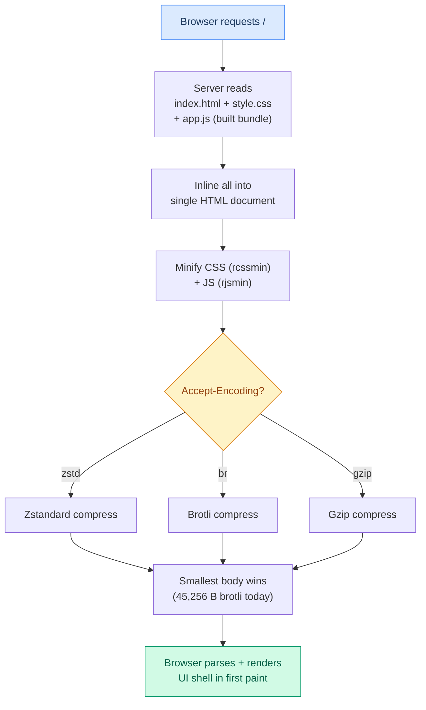
```mermaid
graph TD
    A["Browser requests /"] --> B["Server reads<br/>index.html + style.css<br/>+ app.js (built bundle)"]
    B --> C["Inline all into<br/>single HTML document"]
    C --> D["Minify CSS (rcssmin)<br/>+ JS (rjsmin)"]
    D --> E{"Accept-Encoding?"}
    E -->|zstd| F["Zstandard compress"]
    E -->|br| G["Brotli compress"]
    E -->|gzip| H["Gzip compress"]
    F --> I["Smallest body wins<br/>(45,256 B brotli today)"]
    G --> I
    H --> I
    I --> J["Browser parses + renders<br/>UI shell in first paint"]

    style A fill:#dbeafe,stroke:#3b82f6,color:#1e3a5f
    style J fill:#d1fae5,stroke:#059669,color:#065f46
    style E fill:#fef3c7,stroke:#d97706,color:#92400e
```

---

## 17. Serving Beyond the Loopback Interface

> **As a Project Lead**, I want the dashboard to refuse unauthenticated access when I expose it beyond my own machine, so that a shared network cannot read the decompilation data.

### Acceptance Criteria
- `serve` binds `127.0.0.1` by default; a non-loopback `--bind` requires the explicit `--allow-remote` acknowledgment or the server refuses to start
- `serve --token <secret>` requires every request to carry the secret as `Authorization: Bearer`, as `?token=`, or as the `recoverage_token` cookie the index route sets when the browser opens `/?token=<secret>` once
- An unauthenticated browser gets a 401 HTML page saying to append `?token=`, and it never echoes the token; an unauthenticated API client gets the normal `{error, code, detail}` JSON envelope, and a run of failed tokens is throttled to `429` with `Retry-After`
- `--cors` is allowlist-only through repeatable `--cors-origin` flags; the wildcard is never emitted
- Each of `RECOVERAGE_BIND`, `RECOVERAGE_ALLOW_REMOTE`, `RECOVERAGE_CORS`, `RECOVERAGE_CORS_ORIGIN` and `RECOVERAGE_TOKEN` supplies the default for its flag, and the flag still wins; a malformed value exits 2 naming the variable

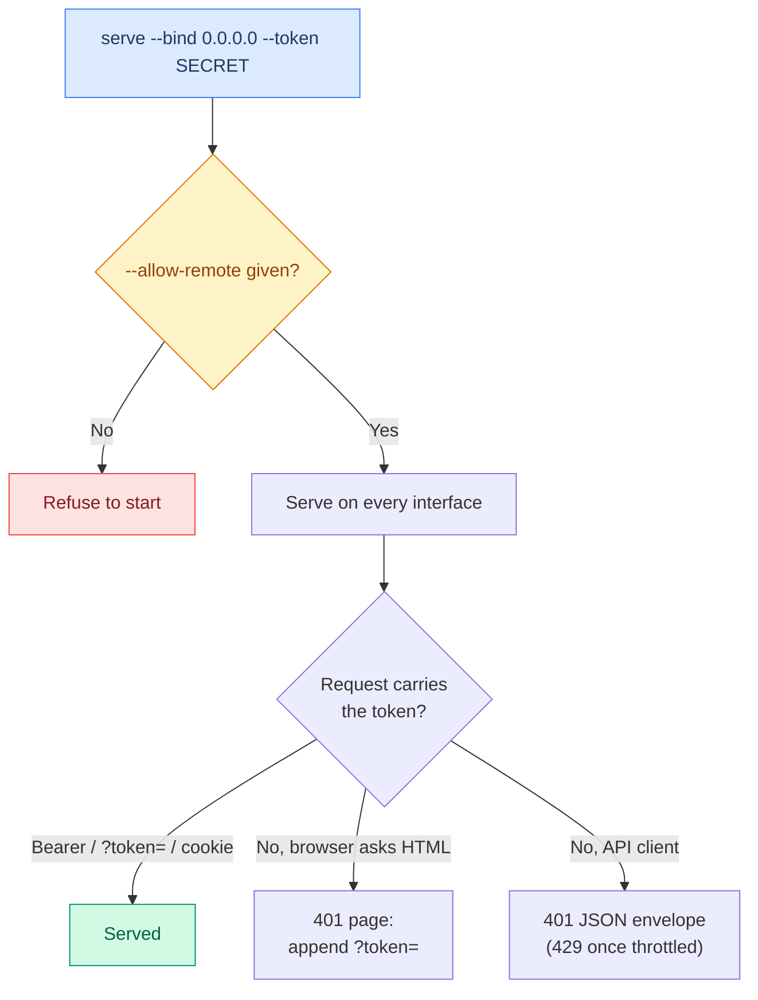
```mermaid
graph TD
    A["serve --bind 0.0.0.0 --token SECRET"] --> B{"--allow-remote given?"}
    B -->|No| C["Refuse to start"]
    B -->|Yes| D["Serve on every interface"]
    D --> E{"Request carries<br/>the token?"}
    E -->|Bearer / ?token= / cookie| F["Served"]
    E -->|No, browser asks HTML| G["401 page:<br/>append ?token="]
    E -->|No, API client| H["401 JSON envelope<br/>(429 once throttled)"]

    style C fill:#fee2e2,stroke:#ef4444,color:#7f1d1d
    style F fill:#d1fae5,stroke:#059669,color:#065f46
    style A fill:#dbeafe,stroke:#3b82f6,color:#1e3a5f
    style B fill:#fef3c7,stroke:#d97706,color:#92400e
```

---

## Future Features

Planned work (Minimap, data-segment XREFs, Diff View) is tracked in [DESIGN.md](DESIGN.md) under "Future Ideas / TODOs", which is the canonical list.

---

## End-to-End Dashboard Workflow

> **As an RE Dev**, I want to go from project setup to visual coverage tracking in a single streamlined workflow.

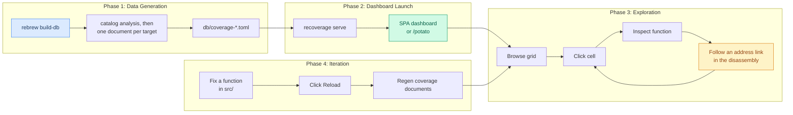
```mermaid
graph LR
    subgraph "Phase 1: Data Generation"
        A["rebrew build-db"] --> B["catalog analysis, then<br/>one document per target"]
        B --> C["db/coverage-*.toml"]
    end

    subgraph "Phase 2: Dashboard Launch"
        C --> E["recoverage serve"]
        E --> F["SPA dashboard<br/>or /potato"]
    end

    subgraph "Phase 3: Exploration"
        F --> G["Browse grid"]
        G --> H["Click cell"]
        H --> I["Inspect function"]
        I --> J["Follow an address link<br/>in the disassembly"]
        J --> H
    end

    subgraph "Phase 4: Iteration"
        K["Fix a function<br/>in src/"] --> L["Click Reload"]
        L --> M["Regen coverage documents"]
        M --> G
    end

    style A fill:#dbeafe,stroke:#3b82f6,color:#1e3a5f
    style F fill:#d1fae5,stroke:#059669,color:#065f46
    style J fill:#fef3c7,stroke:#d97706,color:#92400e
```
